# Restaurant Buchungssystem - Software Requirements Specification

## Inhaltsverzeichnis
1. [Einführung](#1-einführung)  
   1.1 [Zweck](#11-zweck)  
   1.2 [Umfang](#12-umfang)  
   1.3 [Definitionen, Akronyme und Abkürzungen](#13-definitionen-akronyme-und-abkürzungen)  
   1.4 [Referenzen](#14-referenzen)  
   1.5 [Überblick](#15-überblick)  
2. [Gesamtbeschreibung](#2-gesamtbeschreibung)  
   2.1 [Produktperspektive](#21-produktperspektive)  
   2.2 [Produktfunktionen](#22-produktfunktionen)  
   2.3 [Benutzermerkmale](#23-benutzermerkmale)  
   2.4 [Einschränkungen](#24-einschränkungen)  
   2.5 [Annahmen und Abhängigkeiten](#25-annahmen-und-abhängigkeiten)  
   2.6 [Anforderungen der Teilmengen](#26-anforderungen-der-teilmengen)  
   2.7 [Use Case Diagramm](#27-use-case-diagramm)  
3. [Spezifische Anforderungen](#3-spezifische-anforderungen)  
   3.1 [Funktionalität](#31-funktionalität)  
   3.2 [Benutzbarkeit](#32-benutzbarkeit)  
   3.3 [Zuverlässigkeit](#33-zuverlässigkeit)  
   3.4 [Leistung](#34-leistung)  
   3.5 [Unterstützbarkeit](#35-unterstützbarkeit)  
   3.6 [Design-Beschränkungen](#36-design-beschränkungen)  
   3.7 [Online-Benutzerdokumentation und Hilfesystemanforderungen](#37-online-benutzerdokumentation-und-hilfesystemanforderungen)  
   3.8 [Gekaufte Komponenten](#38-gekaufte-komponenten)  
   3.9 [Schnittstellen](#39-schnittstellen)  
   3.10 [Lizenzierungsanforderungen](#310-lizenzierungsanforderungen)  
   3.11 [Rechtliche, urheberrechtliche und andere Hinweise](#311-rechtliche-urheberrechtliche-und-andere-hinweise)  
   3.12 [Anwendbare Standards](#312-anwendbare-standards)  
4. [Unterstützende Informationen](#4-unterstützende-informationen)  

## 1. Einführung  

### 1.1 Zweck  
Der Zweck dieser Software Requirements Specification (SRS) ist es, eine klare und umfassende Beschreibung der Anforderungen für das Restaurant-Buchungssystem bereitzustellen. Sie beschreibt das externe Verhalten des Systems und gibt sowohl funktionale als auch nicht-funktionale Anforderungen vor. Die SRS dient als zentrale Referenz für alle Beteiligten und stellt sicher, dass die Anforderungen an die Software klar und nachvollziehbar dokumentiert sind.

### 1.2 Umfang  
Das Restaurant-Buchungssystem wird als Webanwendung entwickelt, die es sowohl Benutzern (Kunden) als auch Administratoren (Restaurantmitarbeitern) ermöglicht, effektiv zu interagieren.
- Benutzer (Kunden): Haben die Möglichkeit, verfügbare Tische einzusehen, Reservierungen vorzunehmen, bestehende Reservierungen zu stornieren und Feedback zu hinterlassen.
- Administratoren (Restaurantmitarbeiter): Sind dafür verantwortlich, die Tische zu verwalten, Reservierungen einzusehen und gegebenenfalls zu bearbeiten.

Das System wird unter Verwendung der Technologien C#, ASP.NET, HTML, JavaScript/TypeScript und CSS entwickelt und nutzt eine SQL-Datenbank zur Speicherung und Verwaltung der Daten.

Zusätzlich wird die Anwendung sowohl auf Desktop- als auch auf mobilen Browsern zugänglich sein, um eine breite Benutzerbasis zu unterstützen.

### 1.3 Definitionen, Akronyme und Abkürzungen  
- **SRS (Software Requirements Specification)**: Ein Dokument, das die Anforderungen an eine Softwareanwendung beschreibt, einschließlich funktionaler und nicht-funktionaler Anforderungen.
- **Benutzer**: Eine Person, die die Webanwendung nutzt, um Reservierungen vorzunehmen und Informationen über verfügbare Tische abzurufen.
- **Administrator**: Ein Mitarbeiter des Restaurants, der für die Verwaltung des Systems verantwortlich ist, einschließlich der Erstellung von Tischen und der Einsichtnahme sowie Bearbeitung von Reservierungen.
- **Tischplan**: Eine grafische Darstellung der verfügbaren Tische in einem Restaurant, die anzeigt, welche Tische frei oder reserviert sind.
- **Reservierung**: Der Prozess, durch den ein Benutzer einen Tisch für einen bestimmten Zeitpunkt reserviert, um sicherzustellen, dass der Tisch zur gewünschten Zeit verfügbar ist.
- **SQL (Structured Query Language)**: Eine standardisierte Programmiersprache zur Verwaltung und Abfrage von Daten in relationalen Datenbanken.
- **ASP.NET**: Ein von Microsoft entwickeltes Framework zur Erstellung von Webanwendungen und Webdiensten.
- **HTML (Hypertext Markup Language)**: Eine Markup-Sprache zur Strukturierung und Präsentation von Inhalten im Web.
- **CSS (Cascading Style Sheets)**: Eine Stylesheet-Sprache, die das Aussehen und Layout von HTML-Inhalten definiert.
- **JavaScript/TypeScript**: Programmiersprachen, die verwendet werden, um interaktive und dynamische Inhalte auf Webseiten zu erstellen. TypeScript ist eine von Microsoft entwickelte Obermenge von JavaScript, die statische Typisierung bietet.

### 1.4 Referenzen  
Die folgende Liste enthält alle Dokumente und Quellen, auf die im Rahmen dieser Software Requirements Specification (SRS) verwiesen wird:
1. **Template von RUP SRS**  
   Titel: RUP Software Requirements Specification (SRS) Template  
   Link: [RUP SRS Template](https://sceweb.sce.uhcl.edu/helm/REQ_ENG_WEB/My-Files/mod4/rup_srs.dot)
2. **Projektdokumentation**  
   Titel: Restaurant Buchungssystem – Projektdokumentation  
   Autoren: Alina, Moumen, Yahya, Alex, Lukas  
   Link: [Dokumentation auf GitHub](https://github.com/AlinaBoess/SoftwareEngineeringProjektTINF23B5/tree/main/documentation)  
3. **Code-Repository**  
   Titel: Restaurant Buchungssystem – Code-Repository  
   Autoren: Alina, Moumen, Yahya, Alex, Lukas  
   Link: [Code auf GitHub](https://github.com/AlinaBoess/SoftwareEngineeringProjektTINF23B5/tree/main/programCode)  
4. **Blog**  
   Titel: Restaurant Buchungssystem – Wöchentliche Blog-Beiträge  
   Autoren: Alina, Moumen, Yahya, Alex, Lukas  
   Link: [Blog auf GitHub Discussions](https://github.com/AlinaBoess/SoftwareEngineeringProjektTINF23B5/discussions)  

### 1.5 Überblick 
Dieses Dokument ist eine Software Requirements Specification (SRS) für das Restaurant Buchungssystem. Es beschreibt die Anforderungen, die zur Entwicklung der Anwendung erforderlich sind, sowie deren Funktionalität und nicht-funktionale Eigenschaften.
Die SRS ist in die folgenden Hauptabschnitte gegliedert:
1. **Einführung**: Dieser Abschnitt bietet einen Überblick über die Ziele und den Umfang des Dokuments sowie wichtige Definitionen und Referenzen.
2. **Gesamtbeschreibung**: Hier werden die allgemeine Funktionsweise des Systems, die Hauptakteure und deren Interaktionen mit dem System erläutert. Auch werden die wichtigsten Features und Teilsysteme des Restaurant Buchungssystems vorgestellt.
3. **Spezifische Anforderungen**: In diesem Abschnitt werden die detaillierten funktionalen und nicht-funktionalen Anforderungen an das System aufgeführt. Dazu gehören unter anderem Anforderungen an die Benutzeroberfläche, Datenverwaltung, Sicherheitsanforderungen und Performance.
4. **Unterstützende Informationen**: Hier werden zusätzliche Informationen bereitgestellt, die für das Verständnis der SRS relevant sein könnten, einschließlich Glossar, Abkürzungen und andere nützliche Hinweise.
   
Diese Struktur soll sicherstellen, dass alle Aspekte des Restaurant Buchungssystems klar und umfassend dokumentiert sind, um eine effektive Entwicklung und Implementierung der Software zu ermöglichen.

## 2. Gesamtbeschreibung  

### 2.1 Produktperspektive
Das Restaurant-Buchungssystem ist eine Webanwendung, die als eigenständiges System entwickelt wird, wobei auf die Effizienz und Benutzerfreundlichkeit besonderen Wert gelegt wird, indem den Benutzern ermöglicht wird, Reservierungen unabhängig von der Verfügbarkeit des Personals zu verwalten.

Das System ist in eine eventuell bereits bestehende IT-Infrastruktur des Restaurants integrierbar und arbeitet auf Servern, die die Datenbank und die Webanwendung hosten. Benutzer greifen über Webbrowser auf das System zu. Die Anwendung ist modular aufgebaut, sodass zukünftige Erweiterungen, wie etwa die Integration eines Zahlungssystems, möglich sind.

### 2.2 Produktfunktionen
Das System umfasst folgende Kernfunktionen:
- **Tischverwaltung:** Administratoren können Tische erstellen, konfigurieren und deren Verfügbarkeit anzeigen. Diese Funktion bietet eine Übersicht über den Restaurantgrundriss und zeigt, welche Tische verfügbar oder reserviert sind.
- **Reservierungssystem:** Benutzer können verfügbare Tische und Zeitfenster einsehen und Reservierungen vornehmen. Dazu gehört auch die Möglichkeit, bestehende Reservierungen zu stornieren oder zu ändern.
- **Benutzersystem:** Sowohl Benutzer als auch Administratoren müssen ein Konto erstellen, um auf das System zuzugreifen. Benutzerinformationen werden in einer Datenbank gespeichert, um die Reservierungen mit spezifischen Benutzern zu verknüpfen.
- **Feedbacksystem:** Nach einer Reservierung können Benutzer Feedback zur Reservierung und ihrer Erfahrung im Restaurant abgeben. Dieses Feedback wird genutzt, um den Service kontinuierlich zu verbessern und auf die Bedürfnisse der Benutzer einzugehen.

### 2.3 Benutzermerkmale
Es gibt zwei Hauptakteure, die das System nutzen:
- **Benutzer (Kunden):**  Sie sind die primären Nutzer des Systems und erwarten eine einfache, intuitive Möglichkeit, Tische zu reservieren, zu stornieren und ihre Reservierungen zu verwalten. Die Anwendung ist so gestaltet, dass sie benutzerfreundlich ist, sodass die Benutzer nur minimale technische Kenntnisse benötigen. Um Reservierungen vorzunehmen, müssen die Benutzer ein Konto erstellen.
- **Administratoren (Restaurantmitarbeiter):** Administratoren sind für die Verwaltung der Tische und die Einsichtnahme in Reservierungen verantwortlich. Sie verfügen über zusätzliche Berechtigungen, um Tische hinzuzufügen, Zeitfenster zu ändern und überbuchte Zeiten zu verwalten. Administratoren benötigen grundlegende Kenntnisse der Anwendung sowie Zugriff auf das Backend der Webanwendung, um ihre Aufgaben effizient ausführen zu können.

### 2.4 Einschränkungen
- **Technische Einschränkungen:** Das System wird als Webanwendung entwickelt und basiert auf Technologien wie C#, ASP.NET, HTML, JavaScript/TypeScript und CSS. Die Daten werden in einer SQL-Datenbank gespeichert. Es bestehen Einschränkungen hinsichtlich der Serverkapazitäten und Netzwerklatenz, die die Performance des Systems beeinträchtigen können.
- **Sicherheitsanforderungen:** Bei der Verarbeitung persönlicher Daten und Reservierungen müssen strenge Datenschutzrichtlinien, insbesondere die Datenschutz-Grundverordnung (DSGVO), beachtet werden. Die Speicherung und Verarbeitung von Benutzerdaten muss den aktuellen Sicherheitsstandards entsprechen, um die Vertraulichkeit und Integrität der Informationen zu gewährleisten.
- **Systemverfügbarkeit:** Das System sollte nahezu rund um die Uhr verfügbar sein, um Kunden die Möglichkeit zu geben, jederzeit Reservierungen vorzunehmen. Geplante Wartungszeiten müssen minimiert und rechtzeitig im Voraus angekündigt werden, um die Benutzererfahrung nicht zu beeinträchtigen.

### 2.5 Annahmen und Abhängigkeiten
- **Internetverbindung:** Es wird angenommen, dass Benutzer und Administratoren über eine stabile Internetverbindung verfügen, um die Webanwendung effektiv nutzen zu können.
- **Server-Infrastruktur:** Die Anwendung setzt eine stabile Serverumgebung voraus, um eine hohe Verfügbarkeit und eine reibungslose Performance sicherzustellen.
- **Hardware-Abhängigkeiten:** Es wird davon ausgegangen, dass sowohl die Benutzer als auch die Administratoren über Endgeräte (PCs, Tablets, Smartphones) verfügen, die einen modernen Webbrowser unterstützen.
- **Zukunftssicherheit:** Das System soll so konzipiert werden, dass es einfach um zusätzliche Funktionen erweitert werden kann, beispielsweise durch die Integration eines Zahlungssystems oder die Entwicklung einer mobilen App.

### 2.6 Anforderungen der Teilmengen
Das System umfasst verschiedene Teilmengen von Anforderungen:
- **Kernanforderungen:** Diese betreffen die grundlegenden Funktionen des Systems, insbesondere die Reservierung von Tischen und die Verwaltung der Tischverfügbarkeit. Diese Funktionen sind essenziell für die Benutzererfahrung.
- **Erweiterte Anforderungen:** Dazu gehören zusätzliche Features wie das Feedbacksystem, Benachrichtigungen für Benutzer und Administratoren sowie die Möglichkeit zukünftiger Erweiterungen, um die Funktionalität des Systems zu verbessern.
- **Sicherheitsanforderungen:** Diese Anforderungen sind entscheidend für den Schutz der Benutzerdaten. Sie umfassen die Einhaltung von Datenschutzrichtlinien wie der DSGVO sowie Maßnahmen zur Sicherstellung der Datensicherheit.
  
### 2.7 Use Case Diagramm
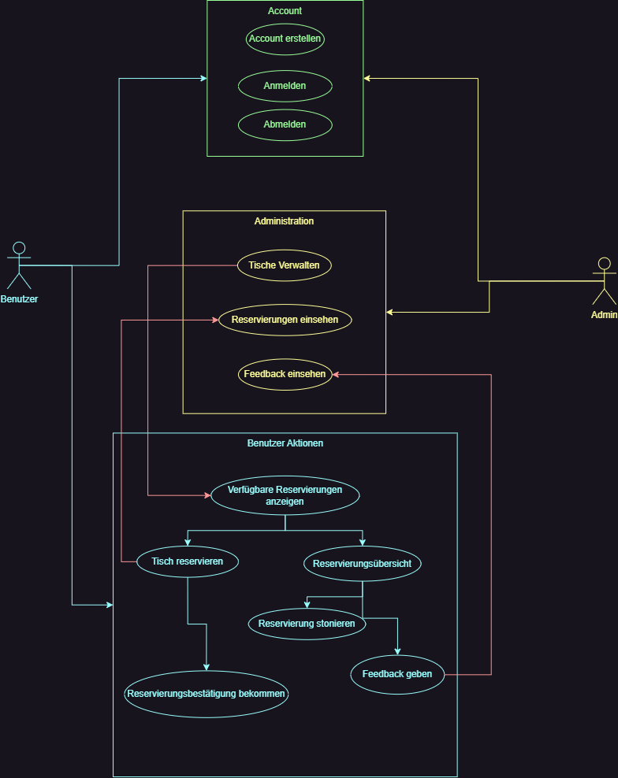

#### Funktionen für Benutzer (3. Semester)
1. **Anmelden:**  
   Der Benutzer gibt seine Zugangsdaten ein, um auf das System zuzugreifen.
2. **Verfügbare Reservierungen anzeigen:**  
   Der Benutzer kann die aktuell verfügbaren Tische und Zeitfenster im Restaurant einsehen.
3. **Tisch reservieren:**  
   Der Benutzer wählt einen Tisch und ein Zeitfenster aus, um eine Reservierung vorzunehmen.
4. **Reservierungsbestätigung:**  
   Nach erfolgreicher Reservierung erhält der Benutzer eine Bestätigung über die Reservierung, meist in Form eines Pop-ups oder einer E-Mail.
5. **Reservierung stornieren:**  
   Der Benutzer hat die Möglichkeit, eine bereits getätigte Reservierung zu stornieren.
6. **Reservierungsübersicht:**  
   Der Benutzer kann eine Übersicht über all seine aktuellen und vergangenen Reservierungen abrufen.
7. **Feedback abgeben:**  
   Nach dem Restaurantbesuch kann der Benutzer Feedback zur Qualität des Services und der Erfahrung abgeben.
#### Funktionen für Administrator (4. Semester)
1. **Anmelden:**  
   Der Administrator gibt seine Zugangsdaten ein, um auf das Verwaltungssystem zuzugreifen.
2. **Reservierungen einsehen:**  
   Der Administrator hat Zugriff auf alle Reservierungen, die von Benutzern vorgenommen wurden, und kann diese einsehen und verwalten.
3. **Tischverwaltung:**  
   Der Administrator kann Tische erstellen, konfigurieren und deren Verfügbarkeit verwalten, um sicherzustellen, dass die Reservierungen reibungslos funktionieren.

## 3. Spezifische Anforderungen  

### 3.1 Funktionalität  
Dieser Abschnitt erläutert die verschiedenen Anwendungsfälle, die im Use-Case Diagramm dargestellt sind, sowie deren Funktionalität.

Bis Dezember planen wir die Implementierung der folgenden Benutzerfunktionen:
- **3.1.1 Anmelden**  
  Benutzer können sich in ihr Konto einloggen, um auf die Funktionen des Systems zuzugreifen.
  
- **3.1.2 Verfügbare Reservierungen anzeigen**  
  Benutzer können eine Übersicht über die verfügbaren Tische und Reservierungszeiten erhalten.
  
- **3.1.3 Tisch reservieren**  
  Benutzer können einen verfügbaren Tisch für ein gewünschtes Datum und eine Uhrzeit reservieren.
  
- **3.1.4 Reservierungsbestätigung**  
  Nach erfolgreicher Reservierung erhalten Benutzer eine Bestätigung ihrer Reservierung.
  
- **3.1.5 Reservierung stornieren**  
  Benutzer haben die Möglichkeit, ihre Reservierungen zu stornieren, falls erforderlich.

- **3.1.6 Feedback geben**  
  User können ihr Feedback zu der Reservierung geben.

- **3.1.7 Reservierungen einsehen**  
  Benutzer können alle ihre Reservireungen einsehen und verwalten.

Bis Juni möchten wir die folgenden Administratorfunktionen implementieren:
- **3.1.8 Anmelden**  
  Administratoren können sich einloggen, um auf ihre Verwaltungsfunktionen zuzugreifen.

- **3.1.9 Tischverwaltung**  
  Administratoren können die Tische im System verwalten, einschließlich der Verfügbarkeit und Einstellungen.

- **3.1.10 Reservierungsübersicht**  
  Administratoren können eine Übersicht über alle Reservierungen erhalten.

- **3.1.11 Feedback abgeben**  
  Administratoren können das Feedback der Benutzer einsehen und darauf reagieren.

#### 3.1.1 Anmelden

- **Beschreibung**  
Dieser Use Case beschreibt den Vorgang, bei dem ein Benutzer sich in das Restaurantbuchungssystem einloggt, um auf die Funktionen des Systems zugreifen zu können. Der Benutzer gibt seine Anmeldedaten ein und erhält bei erfolgreicher Anmeldung Zugriff auf seine Reservierungen und weitere Funktionen.

- **GUI Mockup**  
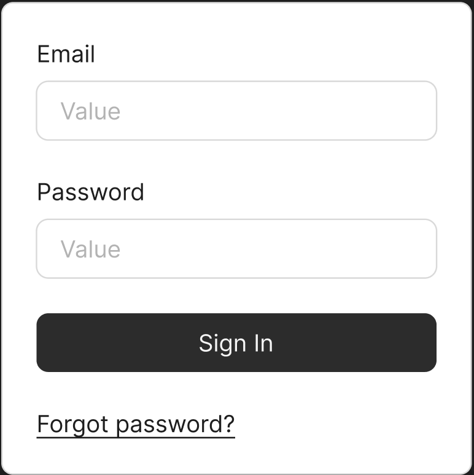

- **Ablauf von Events (Sequenzdiagramm)**  
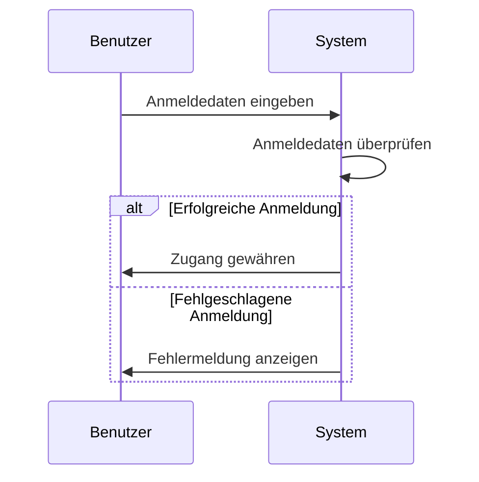
```mermaid
sequenceDiagram
    participant Benutzer
    participant System
    Benutzer ->> System: Anmeldedaten eingeben
    System ->> System: Anmeldedaten überprüfen
    alt Erfolgreiche Anmeldung
        System ->> Benutzer: Zugang gewähren
    else Fehlgeschlagene Anmeldung
        System ->> Benutzer: Fehlermeldung anzeigen
    end
```

- **Vorbedingungen**  
    - Der Benutzer muss bereits ein Konto im System erstellt haben.

- **Nachbedingungen**  
    - Der Benutzer ist erfolgreich angemeldet und hat Zugriff auf die Funktionen des Systems.
    - Bei einer Fehlermeldung bleibt der Benutzer auf der Anmeldeseite.

- **Spezielle Anforderungen**  
    - Die Anmeldedaten müssen sicher über HTTPS übertragen werden.
    - Bei falschen Anmeldedaten sollte eine klare Fehlermeldung angezeigt werden.

- **Aufwandsschätzung / Story Points**  
    - Story Points: 5  
        - Frontend: 2 Punkte  
        - Backend: 3 Punkte (Datenüberprüfung, Fehlerbehandlung)

#### 3.1.2 Konto erstellen

- **Beschreibung**  
Dieser Use Case beschreibt den Vorgang, bei dem ein neuer Benutzer ein Konto im Restaurantbuchungssystem erstellt. Der Benutzer gibt persönliche Informationen wie Name, E-Mail und Passwort ein, um ein neues Benutzerprofil anzulegen und Zugang zu den Funktionen des Systems zu erhalten.

- **GUI Mockup**  
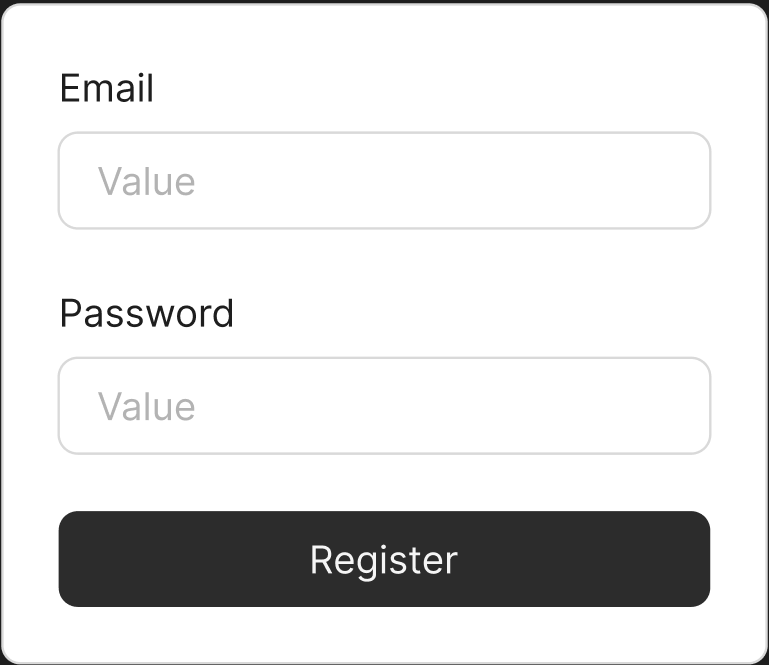

- **Ablauf von Events (Sequenzdiagramm)**  
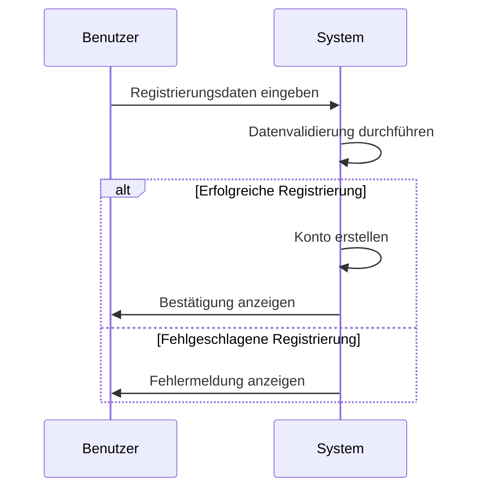
```mermaid
sequenceDiagram
    participant Benutzer
    participant System
    Benutzer ->> System: Registrierungsdaten eingeben
    System ->> System: Datenvalidierung durchführen
    alt Erfolgreiche Registrierung
        System ->> System: Konto erstellen
        System ->> Benutzer: Bestätigung anzeigen
    else Fehlgeschlagene Registrierung
        System ->> Benutzer: Fehlermeldung anzeigen
    end
```

- **Vorbedingungen**  
    - Der Benutzer darf noch kein Konto im System haben.

- **Nachbedingungen**  
    - Der Benutzer hat erfolgreich ein Konto erstellt und kann sich mit seinen Anmeldedaten einloggen.
    - Eine Bestätigungs-E-Mail wird an die angegebene E-Mail-Adresse gesendet.

- **Spezielle Anforderungen**  
    - Die Passwortsicherheit muss gewährleistet sein (z. B. Mindestlänge, Groß- und Kleinbuchstaben, Sonderzeichen).
    - Alle Daten müssen sicher über HTTPS übertragen werden.

- **Aufwandsschätzung / Story Points**  
    - Story Points: 8  
        - Frontend: 3 Punkte  
        - Backend: 5 Punkte (Datenvalidierung, Kontoerstellung, E-Mail-Bestätigung)  

#### 3.1.3 Tisch reservieren

- **Beschreibung**  
Benutzer können einen verfügbaren Tisch für ein gewünschtes Datum und eine Uhrzeit reservieren. Dieser Vorgang beinhaltet die Auswahl des gewünschten Tisches sowie die Eingabe von persönlichen Informationen für die Reservierung.

- **GUI Mockup**  

- **Ablauf von Events (Sequenzdiagramm)**  
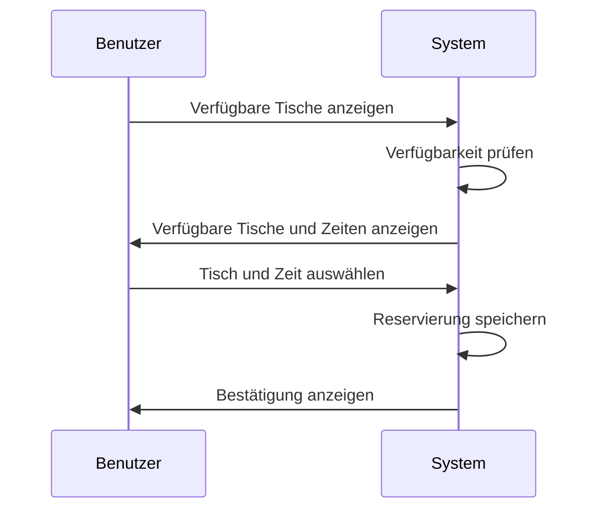
```mermaid
sequenceDiagram
    participant Benutzer
    participant System
    Benutzer ->> System: Verfügbare Tische anzeigen
    System ->> System: Verfügbarkeit prüfen
    System ->> Benutzer: Verfügbare Tische und Zeiten anzeigen
    Benutzer ->> System: Tisch und Zeit auswählen
    System ->> System: Reservierung speichern
    System ->> Benutzer: Bestätigung anzeigen
```

- **Vorbedingungen**  
    - Der Benutzer muss ein Konto erstellt und sich eingeloggt haben.
    - Es muss mindestens ein Tisch im Restaurant für das gewünschte Datum und die Uhrzeit verfügbar sein.

- **Nachbedingungen**  
    - Die Reservierung ist erfolgreich in der Datenbank gespeichert.
    - Der Benutzer erhält eine Bestätigung der Reservierung per E-Mail oder im System.

- **Spezielle Anforderungen**  
    - Die Reservierungsbestätigung sollte innerhalb von 5 Sekunden angezeigt werden.
    - Das System muss sicherstellen, dass es keine Doppelbuchungen gibt.

- **Aufwandsschätzung / Story Points**  
    - Story Points: 8  
        - Frontend: 3 Punkte  
        - Backend: 5 Punkte (Verfügbarkeit prüfen, Reservierung speichern, Doppelbuchung verhindern)

#### 3.1.4 Reservierungsbestätigung

- **Beschreibung**  
Nach erfolgreicher Reservierung erhält der Benutzer eine Bestätigung seiner Reservierung in Form eines Pop-ups. Dieses Pop-up enthält wichtige Informationen wie das Datum, die Uhrzeit, den reservierten Tisch und eventuelle spezielle Anmerkungen.

- **GUI Mockup**  
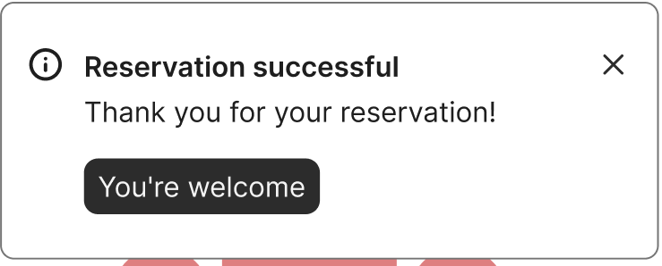

- **Ablauf von Events (Sequenzdiagramm)**  
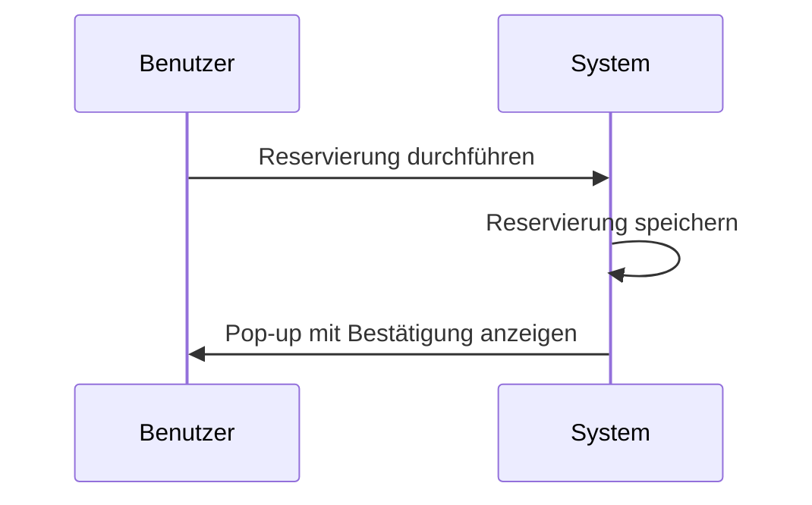
```mermaid
sequenceDiagram
    participant Benutzer
    participant System
    Benutzer ->> System: Reservierung durchführen
    System ->> System: Reservierung speichern
    System ->> Benutzer: Pop-up mit Bestätigung anzeigen
```

- **Vorbedingungen**  
    - Der Benutzer muss eine Reservierung erfolgreich durchgeführt haben.

- **Nachbedingungen**  
    - Der Benutzer erhält eine Bestätigung in Form eines Pop-ups, das alle relevanten Details der Reservierung enthält.

- **Spezielle Anforderungen**  
    - Das Pop-up sollte innerhalb von 5 Sekunden nach der Reservierung angezeigt werden.
    - Das Pop-up muss einfach zu schließen sein, um eine klare Benutzererfahrung zu gewährleisten.

- **Aufwandsschätzung / Story Points**  
    - Story Points: 5  
        - Frontend: 2 Punkte  
        - Backend: 3 Punkte (Bestätigung generieren und anzeigen)  

#### 3.1.5 Reservierung stornieren

- **Beschreibung**  
Benutzer haben die Möglichkeit, ihre Reservierungen zu stornieren, falls erforderlich. Dieser Vorgang ermöglicht es den Benutzern, ihre Buchungen zu ändern, wenn sich ihre Pläne ändern.

- **GUI Mockup**  
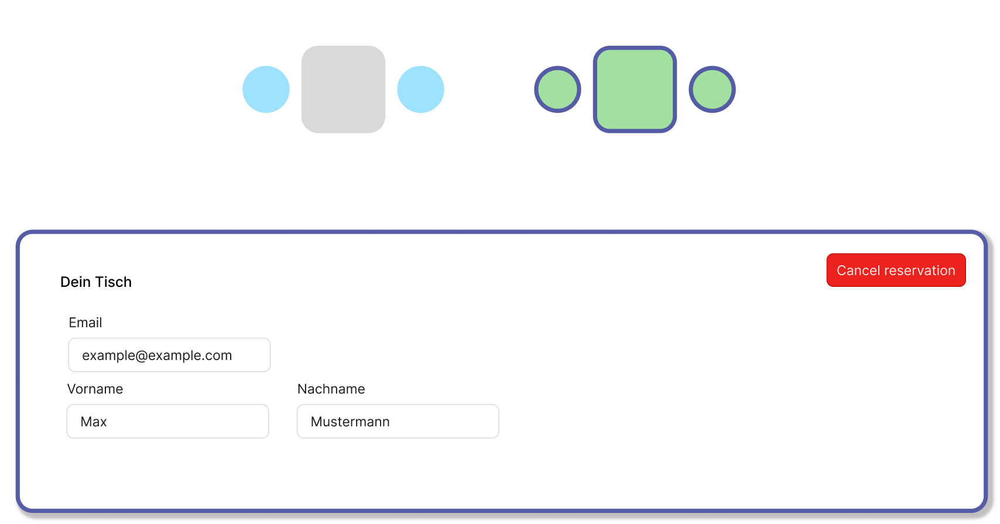

- **Ablauf von Events (Sequenzdiagramm)**  
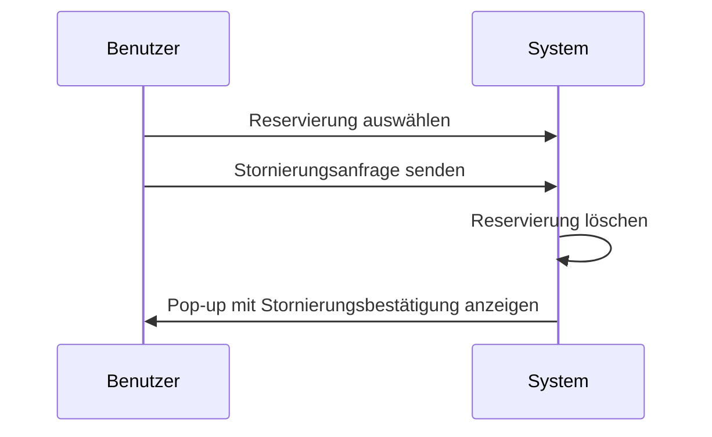
```mermaid
sequenceDiagram
    participant Benutzer
    participant System
    Benutzer ->> System: Reservierung auswählen
    Benutzer ->> System: Stornierungsanfrage senden
    System ->> System: Reservierung löschen
    System ->> Benutzer: Pop-up mit Stornierungsbestätigung anzeigen
```

- **Vorbedingungen**  
    - Der Benutzer muss über eine aktive Reservierung verfügen, die storniert werden kann.

- **Nachbedingungen**  
    - Die Reservierung wird erfolgreich aus der Datenbank gelöscht.
    - Der Benutzer erhält eine Bestätigung der Stornierung in Form eines Pop-ups.

- **Spezielle Anforderungen**  
    - Das Pop-up mit der Stornierungsbestätigung sollte innerhalb von 5 Sekunden nach der Stornierungsanfrage angezeigt werden.
    - Das System muss sicherstellen, dass nur aktive Reservierungen storniert werden können.

- **Aufwandsschätzung / Story Points**  
    - Story Points: 5  
        - Frontend: 2 Punkte  
        - Backend: 3 Punkte (Reservierung löschen und Bestätigung generieren)

#### 3.1.6 Feedback geben

- **Beschreibung**  
Benutzer können nach ihrem Restaurantbesuch Feedback zu ihrer Reservierung und dem Gesamterlebnis geben. Dieses Feedback hilft dem Restaurant, den Service zu verbessern und auf die Wünsche der Gäste einzugehen.

- **Ablauf von Events (Sequenzdiagramm)**  
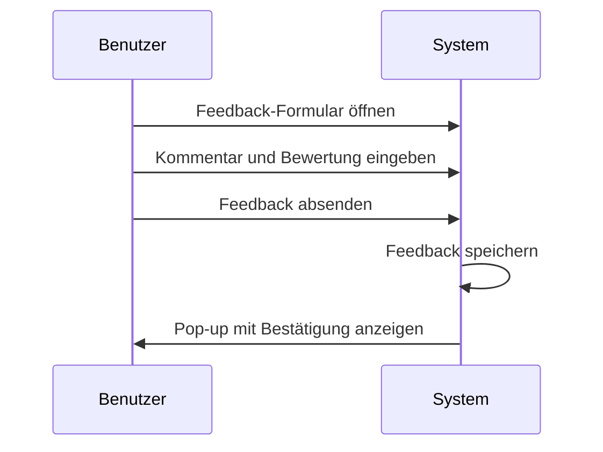
```mermaid
sequenceDiagram
    participant Benutzer
    participant System
    Benutzer ->> System: Feedback-Formular öffnen
    Benutzer ->> System: Kommentar und Bewertung eingeben
    Benutzer ->> System: Feedback absenden
    System ->> System: Feedback speichern
    System ->> Benutzer: Pop-up mit Bestätigung anzeigen
```

- **Vorbedingungen**  
    - Der Benutzer muss über eine abgeschlossene Reservierung im System verfügen, um Feedback abgeben zu können.

- **Nachbedingungen**  
    - Das Feedback wird erfolgreich in der Datenbank gespeichert.
    - Der Benutzer erhält eine Bestätigung seines Feedbacks in Form eines Pop-ups.

- **Spezielle Anforderungen**  
    - Das Pop-up mit der Bestätigung sollte innerhalb von 5 Sekunden nach dem Absenden des Feedbacks angezeigt werden.
    - Das System muss sicherstellen, dass die Eingaben validiert werden, um Spam oder unangemessene Inhalte zu vermeiden.

- **Aufwandsschätzung / Story Points**  
    - Story Points: 8  
        - Frontend: 3 Punkte  
        - Backend: 5 Punkte (Feedback speichern, Validierung)

#### 3.1.7 Reservierungen einsehen

- **Beschreibung**  
Benutzer können alle ihre bisherigen und zukünftigen Reservierungen einsehen und verwalten. Dies ermöglicht es ihnen, Reservierungen zu überprüfen, Änderungen vorzunehmen oder Stornierungen vorzunehmen.

- **GUI Mockup**  

- **Ablauf von Events (Sequenzdiagramm)**  
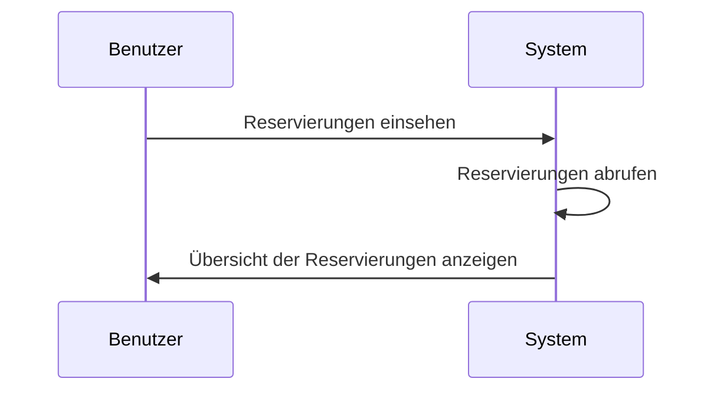
```mermaid
sequenceDiagram
    participant Benutzer
    participant System
    Benutzer ->> System: Reservierungen einsehen
    System ->> System: Reservierungen abrufen
    System ->> Benutzer: Übersicht der Reservierungen anzeigen
```

- **Vorbedingungen**  
    - Der Benutzer muss angemeldet sein, um auf seine Reservierungen zugreifen zu können.

- **Nachbedingungen**  
    - Der Benutzer erhält eine vollständige Übersicht über alle Reservierungen, einschließlich Datum, Uhrzeit, Tisch und Status.

- **Spezielle Anforderungen**  
    - Die Übersicht der Reservierungen sollte innerhalb von 3 Sekunden geladen werden.
    - Der Benutzer sollte die Möglichkeit haben, jede Reservierung direkt aus der Übersicht zu bearbeiten oder zu stornieren.

- **Aufwandsschätzung / Story Points**  
    - Story Points: 5  
        - Frontend: 2 Punkte  
        - Backend: 3 Punkte (Reservierungen abrufen)

#### 3.1.8 Anmelden

- **Beschreibung**  
Administratoren können sich in das System einloggen, um Zugriff auf ihre Verwaltungsfunktionen zu erhalten. Dies ermöglicht es ihnen, Reservierungen zu verwalten und wichtige Systeminformationen einzusehen.

- **GUI Mockup**  

- **Ablauf von Events (Sequenzdiagramm)**  
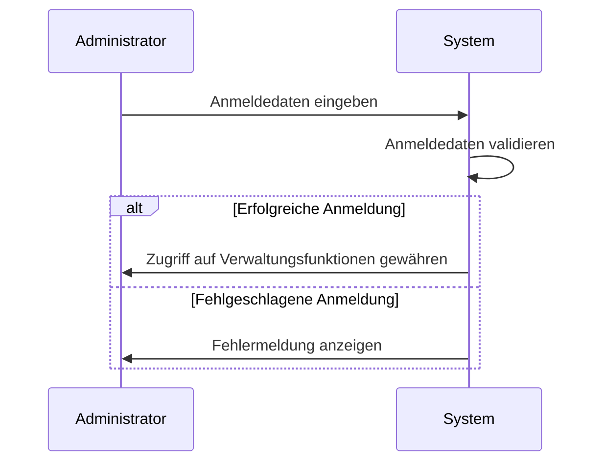
```mermaid
sequenceDiagram
    participant Administrator
    participant System
    Administrator ->> System: Anmeldedaten eingeben
    System ->> System: Anmeldedaten validieren
    alt Erfolgreiche Anmeldung
        System ->> Administrator: Zugriff auf Verwaltungsfunktionen gewähren
    else Fehlgeschlagene Anmeldung
        System ->> Administrator: Fehlermeldung anzeigen
    end
```

- **Vorbedingungen**  
    - Der Administrator muss über ein gültiges Konto im System verfügen.

- **Nachbedingungen**  
    - Bei erfolgreicher Anmeldung hat der Administrator Zugriff auf die Verwaltungsoberfläche.
    - Bei fehlerhaften Anmeldedaten wird eine Fehlermeldung angezeigt.

- **Spezielle Anforderungen**  
    - Die Anmeldedaten sollten innerhalb von 2 Sekunden validiert werden.
    - Bei drei aufeinanderfolgenden fehlgeschlagenen Anmeldeversuchen sollte der Zugang für 15 Minuten gesperrt werden.

- **Aufwandsschätzung / Story Points**  
    - Story Points: 3  
        - Frontend: 1 Punkt  
        - Backend: 2 Punkte (Anmeldedaten validieren)

#### 3.1.9 Tischverwaltung

- **Beschreibung**  
Administratoren können die Tische im System verwalten, einschließlich der Anpassung von Verfügbarkeiten, Einstellungen und der Zuweisung von Tischen zu bestimmten Reservierungen. Dies ermöglicht eine effiziente Organisation der Tischressourcen im Restaurant.

- **Ablauf von Events (Sequenzdiagramm)**  
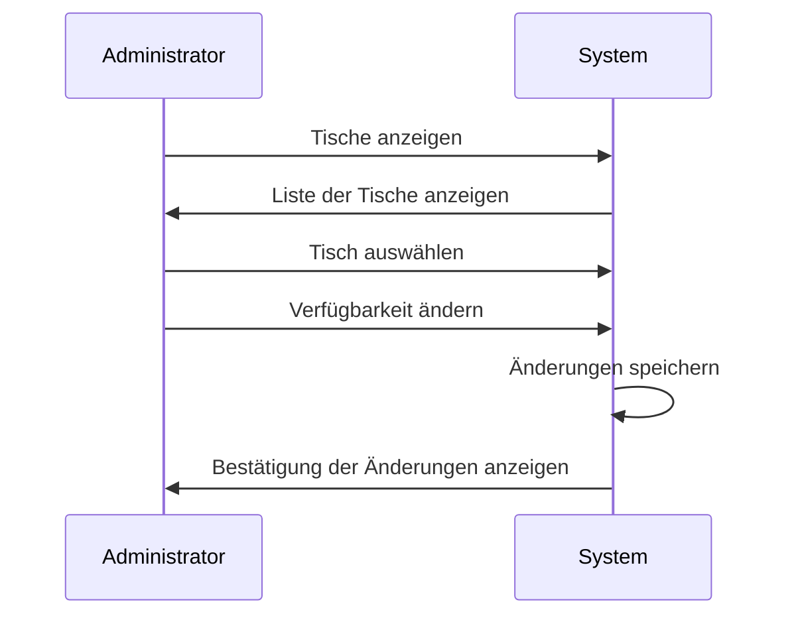
```mermaid
sequenceDiagram
    participant Administrator
    participant System
    Administrator ->> System: Tische anzeigen
    System ->> Administrator: Liste der Tische anzeigen
    Administrator ->> System: Tisch auswählen
    Administrator ->> System: Verfügbarkeit ändern
    System ->> System: Änderungen speichern
    System ->> Administrator: Bestätigung der Änderungen anzeigen
```

- **Vorbedingungen**  
    - Der Administrator muss angemeldet sein.
    - Es müssen Tische im System vorhanden sein.

- **Nachbedingungen**  
    - Änderungen an der Tischverfügbarkeit und den Einstellungen sind erfolgreich in der Datenbank gespeichert.
    - Der Administrator erhält eine Bestätigung über die erfolgten Änderungen.

- **Spezielle Anforderungen**  
    - Änderungen an der Tischverfügbarkeit sollten innerhalb von 3 Sekunden gespeichert werden.
    - Das System muss sicherstellen, dass keine Konflikte bei der Zuweisung von Tischen auftreten.

- **Aufwandsschätzung / Story Points**  
    - Story Points: 5  
        - Frontend: 2 Punkte  
        - Backend: 3 Punkte (Änderungen speichern, Konflikte prüfen)

#### 3.1.10 Reservierungsübersicht

- **Beschreibung**  
Administratoren können eine umfassende Übersicht über alle Reservierungen im System einsehen. Diese Funktion ermöglicht es ihnen, die aktuelle Auslastung des Restaurants zu überwachen und gegebenenfalls Anpassungen vorzunehmen.

- **Ablauf von Events (Sequenzdiagramm)**  
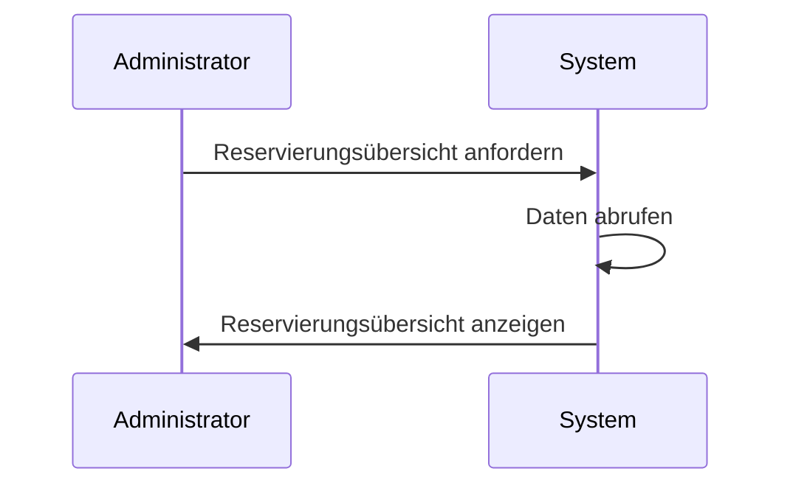
```mermaid
sequenceDiagram
    participant Administrator
    participant System
    Administrator ->> System: Reservierungsübersicht anfordern
    System ->> System: Daten abrufen
    System ->> Administrator: Reservierungsübersicht anzeigen
```

- **Vorbedingungen**  
    - Der Administrator muss angemeldet sein.
    - Es müssen Reservierungen im System vorhanden sein.

- **Nachbedingungen**  
    - Die Übersicht über alle Reservierungen wird erfolgreich angezeigt.
    - Der Administrator erhält Informationen zu Reservierungen, einschließlich Datum, Uhrzeit, Tisch und Benutzerinformationen.

- **Spezielle Anforderungen**  
    - Die Reservierungsübersicht sollte innerhalb von 3 Sekunden geladen werden.
    - Die Übersicht muss eine Filter- und Sortierfunktion bieten, um Reservierungen nach verschiedenen Kriterien anzuzeigen (z. B. Datum, Tisch).

- **Aufwandsschätzung / Story Points**  
    - Story Points: 5  
        - Frontend: 2 Punkte  
        - Backend: 3 Punkte (Daten abrufen, Filter- und Sortierfunktionen implementieren)

#### 3.1.11 Feedback abgeben

- **Beschreibung**  
Administratoren können das Feedback der Benutzer einsehen, analysieren und darauf reagieren. Diese Funktion ermöglicht es ihnen, die Benutzererfahrung zu verbessern und etwaige Probleme zeitnah zu adressieren.

- **Ablauf von Events (Sequenzdiagramm)**  
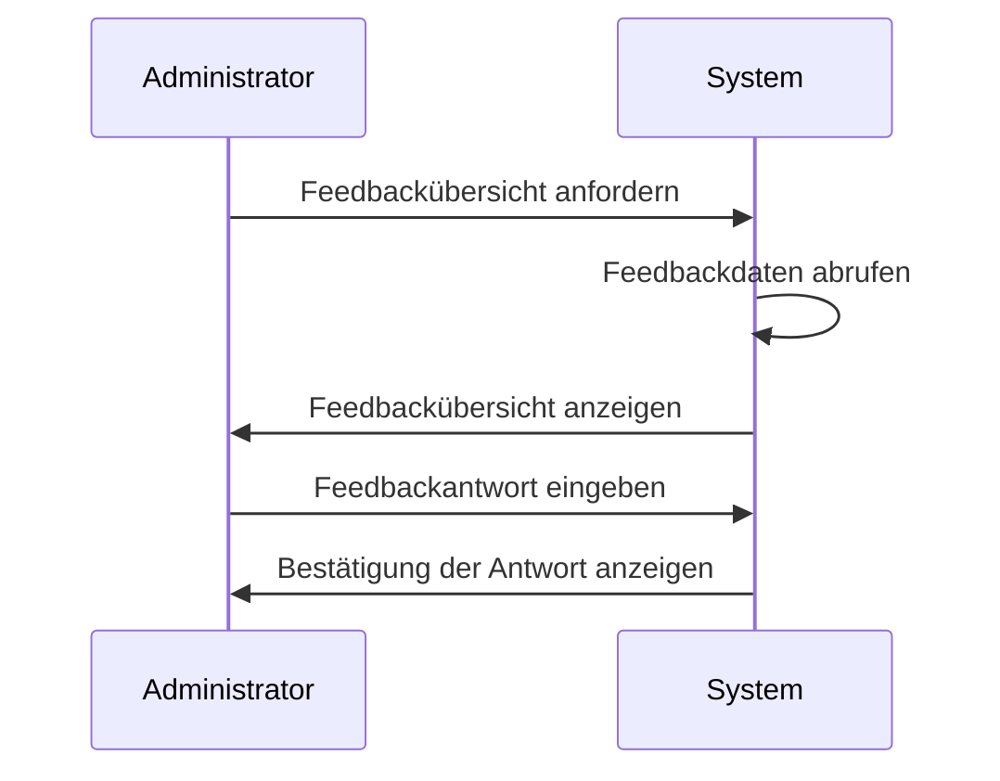
```mermaid
sequenceDiagram
    participant Administrator
    participant System
    Administrator ->> System: Feedbackübersicht anfordern
    System ->> System: Feedbackdaten abrufen
    System ->> Administrator: Feedbackübersicht anzeigen
    Administrator ->> System: Feedbackantwort eingeben
    System ->> Administrator: Bestätigung der Antwort anzeigen
```

- **Vorbedingungen**  
    - Der Administrator muss angemeldet sein.
    - Es muss mindestens ein Feedback von Benutzern im System vorhanden sein.

- **Nachbedingungen**  
    - Das Feedback wird erfolgreich angezeigt.
    - Der Administrator kann auf das Feedback reagieren, und die Antwort wird im System gespeichert.

- **Spezielle Anforderungen**  
    - Die Feedbackübersicht sollte innerhalb von 4 Sekunden geladen werden.
    - Administratoren sollten die Möglichkeit haben, auf spezifisches Feedback direkt zu antworten.
    - Es muss eine Historie der Antworten auf Benutzerfeedback geführt werden.

- **Aufwandsschätzung / Story Points**  
    - Story Points: 8  
        - Frontend: 3 Punkte  
        - Backend: 5 Punkte (Feedbackdaten abrufen, Antworten speichern)

### 3.2 Benutzbarkeit  
#### 3.2.1 Benutzeroberfläche (UI)
- **Beschreibung**  
Die Benutzeroberfläche muss intuitiv und benutzerfreundlich gestaltet sein, um eine einfache Navigation und Nutzung des Systems zu ermöglichen.  
- **GUI Mockup**  
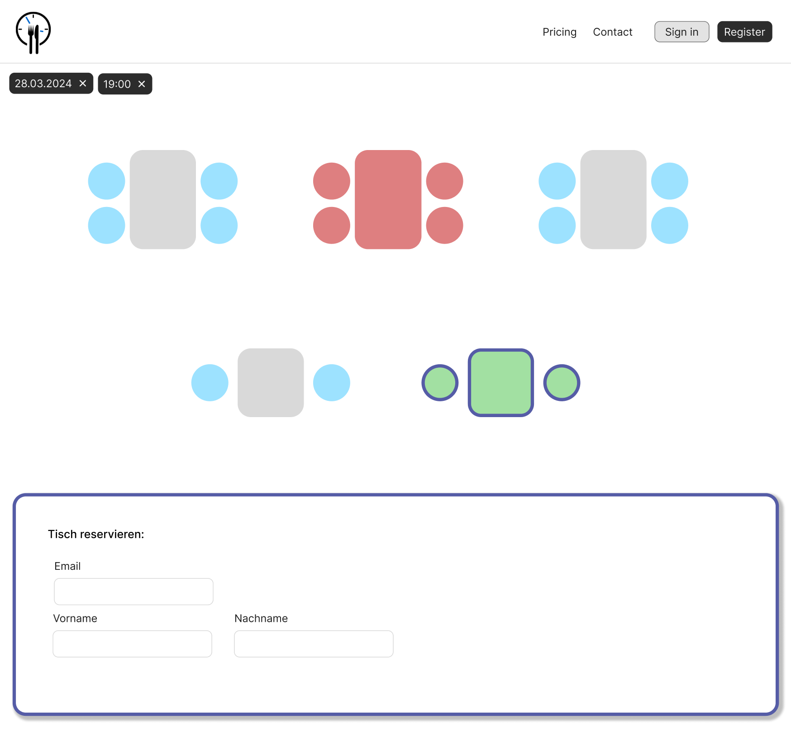
- **Spezielle Anforderungen**  
    - Die Schriftgröße sollte anpassbar sein, um die Lesbarkeit zu verbessern.  
    - Die Anwendung muss auf verschiedenen Bildschirmgrößen (PC, Tablet, Smartphone) responsiv sein.  
#### 3.2.2 Benutzerführung
- **Beschreibung**  
Das System soll den Benutzer durch den Reservierungsprozess führen, um sicherzustellen, dass alle erforderlichen Schritte leicht verständlich sind.   
#### 3.2.3 Fehlermeldungen
- **Beschreibung**  
Das System muss klare und hilfreiche Fehlermeldungen bereitstellen, wenn Benutzer fehlerhafte Eingaben machen oder wenn Probleme auftreten.  
- **Spezielle Anforderungen**  
    - Fehlermeldungen sollten direkt neben dem Eingabefeld angezeigt werden, das das Problem verursacht hat.  
    - Fehlermeldungen sollten Vorschläge zur Behebung des Problems enthalten, z. B. „Bitte überprüfen Sie, ob das Datum in der Zukunft liegt.“  
#### 3.2.4 Zugänglichkeit
- **Beschreibung**  
Das System soll größtenteils den WCAG-Richtlinien (Web Content Accessibility Guidelines) entsprechen, um sicherzustellen, dass es für alle Benutzer, einschließlich Menschen mit Behinderungen, zugänglich ist.  
- **Spezielle Anforderungen**  
    - Alle Bilder und Grafiken müssen alternative Texte (Alt-Text) haben, um die Zugänglichkeit für Screenreader zu gewährleisten.  
#### 3.2.5 Benutzerfeedback
- **Beschreibung**  
Das System soll eine Möglichkeit bieten, dass Benutzer Feedback zur Benutzeroberfläche und Benutzererfahrung geben können.  
- **Spezielle Anforderungen**  
    - Es sollte eine Feedback-Schaltfläche geben, die ein einfaches Formular zur Eingabe von Anregungen oder Beschwerden öffnet.  
    - Benutzer sollten nach der Nutzung des Systems (z. B. nach einer Reservierung) zu Feedback aufgefordert werden. 

### 3.3 Zuverlässigkeit  
#### 3.3.1 Verfügbarkeit
- **Beschreibung**  
Das System soll eine Verfügbarkeit von mindestens 99,5 % bieten. Dies bedeutet, dass es während der Betriebszeiten, die von Montag bis Sonntag von 08:00 bis 22:00 Uhr sind, regelmäßig aufgerufen werden kann.  
- **Spezielle Anforderungen**  
    - Wartungsarbeiten müssen im Voraus angekündigt werden und sollen idealerweise außerhalb der Betriebszeiten stattfinden, um die Auswirkungen auf die Benutzer zu minimieren.  
    - Im Falle von Wartungsarbeiten sollte ein degradiertes Betriebsmodell zur Verfügung stehen, um grundlegende Funktionen weiterhin anzubieten.

#### 3.3.2 Mean Time Between Failures (MTBF)
- **Beschreibung**  
Die durchschnittliche Zeit zwischen Ausfällen (MTBF) des Systems sollte mindestens 300 Stunden betragen.  
- **Spezielle Anforderungen**  
    - Das System muss so konzipiert sein, dass es für eine kontinuierliche Nutzung über einen Zeitraum von mehreren Wochen ohne Ausfälle betriebsfähig bleibt.

#### 3.3.3 Mean Time To Repair (MTTR)
- **Beschreibung**  
Die durchschnittliche Reparaturzeit (MTTR) nach einem Systemausfall sollte nicht mehr als 4 Stunden betragen.  
- **Spezielle Anforderungen**  
    - Es sollte ein Notfallplan entwickelt werden, der schnelle Reaktionszeiten bei Ausfällen garantiert, um die Betriebszeit so schnell wie möglich wiederherzustellen.

#### 3.3.4 Genauigkeit
- **Beschreibung**  
Das System muss eine Genauigkeit von mindestens 95 % bei der Verarbeitung von Reservierungsanfragen gewährleisten.  
- **Spezielle Anforderungen**  
    - Bei der Anzeige der verfügbaren Tische muss das System sicherstellen, dass die Daten in Echtzeit aktualisiert werden, um Verwirrung zu vermeiden.

#### 3.3.5 Maximale Fehler- oder Defektrate
- **Beschreibung**  
Die maximale Fehler- oder Defektrate des Systems sollte nicht mehr als 1 Bug pro 1000 Zeilen Code (Bugs/KLOC) betragen.  
- **Spezielle Anforderungen**  
    - Dies gilt für die erste Produktionsversion des Systems und wird in zukünftigen Versionen überprüft und angepasst.

#### 3.3.6 Fehler- oder Defektrate
- **Beschreibung**  
Die Fehler- oder Defektrate muss in drei Kategorien unterteilt werden: geringfügige, signifikante und kritische Fehler.  
- **Spezielle Anforderungen**  
    - **Kritische Fehler:** Vollständiger Verlust von Daten oder vollständige Unfähigkeit, bestimmte Teile der Systemfunktionalität zu nutzen.  
    - **Signifikante Fehler:** Beeinträchtigung der Benutzererfahrung, die jedoch das System nicht unbenutzbar macht.  
    - **Geringfügige Fehler:** Kleinere Fehler, die keine signifikanten Auswirkungen auf die Funktionalität haben.

### 3.4 Leistung  
#### 3.4.1 Antwortzeit für Transaktionen
- **Beschreibung**  
Das System muss in der Lage sein, Transaktionen mit einer durchschnittlichen Antwortzeit von maximal 2 Sekunden durchzuführen. In Spitzenzeiten darf die maximale Antwortzeit nicht mehr als 5 Sekunden betragen.  
- **Bezug auf Use Cases**  
    - **Tisch reservieren:** Die Antwortzeit für die Reservierung eines Tisches sollte innerhalb von 2 Sekunden erfolgen.  
    - **Reservierung stornieren:** Bei der Stornierung einer Reservierung sollte die Bestätigung innerhalb von 2 Sekunden angezeigt werden.  
#### 3.4.2 Durchsatz
- **Beschreibung**  
Das System sollte in der Lage sein, mindestens 20 Transaktionen pro Sekunde (TPS) zu verarbeiten. Dies stellt sicher, dass mehrere Benutzer gleichzeitig Reservierungen vornehmen oder stornieren können, ohne dass die Leistung leidet.  
- **Bezug auf Use Cases**  
    - **Benutzersystem:** Bei gleichzeitigen Anfragen von mehreren Benutzern sollte das System weiterhin effizient arbeiten.

#### 3.4.3 Kapazität
- **Beschreibung**  
Das System muss in der Lage sein, bis zu 1000 gleichzeitige Benutzeranfragen zu verarbeiten, ohne dass es zu Leistungseinbußen kommt. Die Kapazität für gleichzeitige Transaktionen sollte mindestens 2000 pro Stunde betragen.  

#### 3.4.4 Degradationsmodi
- **Beschreibung**  
Im Falle einer Systemdegradation sollte das System einen Basisbetrieb anbieten, bei dem Benutzer weiterhin Tische einsehen und Reservierungen vornehmen können, jedoch ohne einige erweiterte Funktionen wie das Feedbacksystem.  
- **Spezielle Anforderungen**  
    - Die Benutzeroberfläche muss während des Degradationsbetriebs klar kommunizieren, dass einige Funktionen möglicherweise nicht verfügbar sind.

#### 3.4.5 Ressourcenauslastung
- **Beschreibung**  
Das System sollte effizient mit Ressourcen umgehen, um eine optimale Leistung zu gewährleisten. Die maximalen Ressourcennutzungseinstellungen sollten wie folgt sein:  
    - **Speicher:** Maximal 1 GB RAM pro Instanz  
    - **Festplattenspeicher:** Mindestens 100 GB für die Datenbank  
    - **Kommunikationsressourcen:** Die Bandbreite sollte 1 MB/s pro Benutzeranfrage nicht überschreiten.

### 3.5 Unterstützbarkeit  
#### 3.5.1 Codierungsstandards
- **Beschreibung**  
Das System muss den folgenden Codierungsstandards folgen, um die Wartbarkeit und Lesbarkeit des Codes zu gewährleisten:  
  - Verwendung von **C# Naming Conventions**: 
    - Klassen- und Methodennamen sollten im PascalCase geschrieben werden.
    - Variablen- und Feldnamen sollten im camelCase geschrieben werden.  
  - **Code-Kommentare**: Jeder Codeabschnitt sollte durch Kommentare dokumentiert werden, um die Funktionsweise des Codes zu erklären und die Verständlichkeit zu erhöhen. 

#### 3.5.2 Benennungskonventionen
- **Beschreibung**  
Alle Elemente des Systems (Variablen, Klassen, Methoden, etc.) müssen konsistent benannt werden, um Verwirrung zu vermeiden und die Wartbarkeit zu verbessern. Dies umfasst:  
  - Verwendung von klaren und beschreibenden Namen, die die Funktionalität der jeweiligen Komponente widerspiegeln.  
  - Einheitliche Benennung von Datenbanktabellen und -spalten, z. B. `reservierungen`, `benutzer`, `tische`.

#### 3.5.3 Klassenbibliotheken
- **Beschreibung**  
Das System sollte auf bewährte Klassenbibliotheken zurückgreifen, die regelmäßig aktualisiert werden. Die Verwendung von gängigen Bibliotheken fördert die Wiederverwendbarkeit von Code und erleichtert die Wartung. Beispiele hierfür sind:  
  - **Entity Framework** für Datenzugriff.  
  - **ASP.NET Identity** für die Verwaltung von Benutzerauthentifizierung und -autorisierung.  

#### 3.5.4 Wartungszugang
- **Beschreibung**  
Das System muss über einen klar definierten Wartungszugang verfügen, der es Administratoren ermöglicht, Wartungsarbeiten effizient durchzuführen, ohne den Betrieb der Anwendung zu stören. Dazu gehören:  
  - Ein Admin-Panel zur Verwaltung von Tischen, Reservierungen und Benutzerdaten.  
  - Protokollierung von Fehlern und Systemereignissen für die Fehlersuche und -analyse.  

#### 3.5.5 Wartungshilfsprogramme
- **Beschreibung**  
Das System sollte Wartungshilfsprogramme beinhalten, die es den Entwicklern ermöglichen, gängige Wartungsaufgaben zu automatisieren. Dazu gehören:  
  - **Backup-Skripte** für die regelmäßige Sicherung der Datenbank.  
  - **Monitoring-Tools**, um die Systemleistung in Echtzeit zu überwachen und bei Bedarf Alarmmeldungen zu generieren.

### 3.6 Design-Beschränkungen  
#### 3.6.1 Verwendete Programmiersprachen
- **Beschreibung**  
Das System muss in den folgenden Programmiersprachen entwickelt werden:  
  - **C#**: Als Hauptprogrammiersprache für die Backend-Entwicklung unter Verwendung von ASP.NET.  
  - **HTML, CSS und JavaScript/TypeScript**: Für die Frontend-Entwicklung, um eine ansprechende Benutzeroberfläche zu gewährleisten.  

#### 3.6.2 Softwareentwicklungsprozess
- **Beschreibung**  
Das Entwicklungsteam muss den **Agilen Softwareentwicklungsprozess** anwenden, um iterative und inkrementelle Fortschritte zu erzielen. Dies umfasst regelmäßige Sprint-Planungen, Reviews und Retrospektiven zur kontinuierlichen Verbesserung.  

#### 3.6.3 Entwicklungswerkzeuge
- **Beschreibung**  
Die folgenden Entwicklungswerkzeuge sind für die Erstellung der Anwendung vorgeschrieben:  
  - **Visual Studio**: Als integrierte Entwicklungsumgebung (IDE) für die Entwicklung in C# und ASP.NET.  
  - **Git**: Für die Versionskontrolle des Quellcodes, um die Zusammenarbeit im Team zu ermöglichen.  
  - **SQL Server Management Studio**: Für die Verwaltung der SQL-Datenbank.  

#### 3.6.4 Architektur- und Designbeschränkungen
- **Beschreibung**  
Das System muss eine **Client-Server-Architektur** verwenden, bei der der Server die Geschäftslogik und die Datenbankverwaltung übernimmt, während der Client (Browser) die Benutzeroberfläche darstellt. Diese Architektur soll sicherstellen, dass die Anwendung skalierbar und wartbar ist.  

#### 3.6.5 Verwendung von gekauften Komponenten
- Es sollen keine gekauften Komponenten verwendet werden. Alles wird selbst erstellt. 

#### 3.6.6 Datenbankmanagementsystem
- **Beschreibung**  
Das System muss eine relationale Datenbank mit **SQL Server** als Datenbankmanagementsystem verwenden, um die Datenverfügbarkeit, Integrität und Konsistenz zu gewährleisten.  

### 3.7 Online-Benutzerdokumentation und Hilfesystemanforderungen  
#### 3.7.1 Anforderungen
- **Beschreibung**  
Für das Restaurant-Buchungssystem ist keine umfangreiche Online-Benutzerdokumentation oder ein Hilfesystem erforderlich.  
Die Benutzeroberfläche wird so gestaltet, dass sie intuitiv und benutzerfreundlich ist, sodass die Benutzer in der Lage sind, alle erforderlichen Funktionen ohne zusätzliche Unterstützung zu nutzen.  

#### 3.7.2 Unterstützung
- **Notwendigkeit**  
Da das System gezielt auf Benutzerfreundlichkeit ausgerichtet ist, ist ein separates Hilfesystem nicht notwendig. Bei spezifischen Fragen oder Problemen sollen die Benutzer die Möglichkeit haben, sich direkt an den Restaurant-Support zu wenden, der während der Geschäftszeiten zur Verfügung steht.  

### 3.8 Gekaufte Komponenten  
#### 3.8.1 Beschreibung
Für das Restaurant-Buchungssystem sind keine gekauften Komponenten erforderlich.  
Das gesamte System wird mit Open-Source-Technologien und selbstentwickeltem Code implementiert, wodurch zusätzliche Kosten für Lizenzgebühren oder spezielle Komponenten vermieden werden.

#### 3.8.2 Lizenzierungs- und Nutzungseinschränkungen
Da keine externen gekauften Komponenten verwendet werden, entfallen alle Lizenzierungs- und Nutzungseinschränkungen. Alle entwickelten Softwarekomponenten unterliegen den internen Richtlinien des Entwicklungsteams und können ohne zusätzliche Beschränkungen genutzt werden.

#### 3.8.3 Kompatibilitäts- und Interoperabilitätsstandards
Da keine externen Komponenten verwendet werden, sind auch keine spezifischen Kompatibilitäts- oder Interoperabilitätsstandards erforderlich. Die entwickelten Komponenten werden so gestaltet, dass sie nahtlos innerhalb der Systemarchitektur funktionieren.

### 3.9 Schnittstellen  
#### 3.9.1 Benutzeroberflächen
Die Benutzeroberfläche des Restaurant-Buchungssystems wird webbasiert sein und eine intuitive, benutzerfreundliche Gestaltung aufweisen. Die Hauptfunktionen umfassen:
- **Reservierungsseite:** Benutzer können verfügbare Tische, Datum und Uhrzeit auswählen und Reservierungen vornehmen.
- **Administrationsseite:** Administratoren können Tische verwalten, Reservierungen einsehen und bearbeiten.
- **Feedback-Seite:** Benutzer können nach einer Reservierung Feedback zur Erfahrung im Restaurant abgeben.

Die Benutzeroberfläche wird in HTML, CSS und JavaScript/TypeScript entwickelt und ist responsiv, sodass sie auf verschiedenen Geräten (PCs, Tablets, Smartphones) optimal angezeigt wird.

#### 3.9.2 Hardware-Schnittstellen
Für das Restaurant-Buchungssystem sind keine spezifischen Hardware-Schnittstellen erforderlich. Das System wird vollständig auf Servern betrieben, auf die über das Internet zugegriffen wird. 
Die Benutzer benötigen lediglich ein Endgerät mit Internetzugang und einen modernen Webbrowser.

#### 3.9.3 Software-Schnittstellen
Das System interagiert mit einer SQL-Datenbank zur Speicherung und Verwaltung von Benutzerdaten, Reservierungen und Tischen. Es werden keine externen Softwarekomponenten verwendet, sodass alle Schnittstellen intern innerhalb des Systems liegen.

Die Hauptsoftware-Schnittstelle ist:
- **Datenbankschnittstelle:** Diese Schnittstelle ermöglicht den Zugriff auf die Datenbank, um Daten zu speichern, abzurufen und zu bearbeiten.

#### 3.9.4 Kommunikationsschnittstellen
Das Restaurant-Buchungssystem kommuniziert über das Internet. Die Kommunikationsschnittstellen umfassen:
- **HTTP/HTTPS:** Für die sichere Übertragung von Daten zwischen dem Benutzer und dem Server.
- **WebSocket (optional):** Für Echtzeit-Kommunikation, z. B. Benachrichtigungen über Reservierungsbestätigungen oder Änderungen.

### 3.10 Lizenzierungsanforderungen  
Für das Restaurant-Buchungssystem gelten folgende Lizenzierungsanforderungen:

- **Keine Lizenzkosten:** Da es sich um ein Studentenprojekt handelt, fallen keine Lizenzgebühren für die Nutzung der Software an.
- **Open-Source-Nutzung:** Die Software wird unter einer Open-Source-Lizenz bereitgestellt, die es Benutzern erlaubt, die Anwendung zu nutzen, zu modifizieren und zu verteilen, solange die ursprünglichen Autoren genannt werden.
- **Einhaltung von Lizenzen Dritter:** Bei der Verwendung von externen Bibliotheken oder Tools müssen die jeweiligen Lizenzbedingungen eingehalten werden.
- **Kollaboration und Dokumentation:** Alle Teammitglieder sind verpflichtet, an der Dokumentation des Projekts mitzuarbeiten, um Transparenz in Bezug auf die verwendeten Technologien und Lizenzen zu gewährleisten.

### 3.11 Rechtliche, urheberrechtliche und andere Hinweise 
Für das Restaurant-Buchungssystem gelten folgende rechtliche und urheberrechtliche Hinweise:

- **Urheberrecht:** Alle Quellcodes, Dokumentationen und Designmaterialien, die im Rahmen dieses Projekts erstellt wurden, sind urheberrechtlich geschützt. Die Rechte liegen beim Entwicklungsteam (Alina Moumen, Yahya, Alex, Lukas) und dürfen ohne deren Zustimmung nicht verwendet oder verbreitet werden.

- **Haftungsausschluss:** Die Software wird "so wie sie ist" bereitgestellt, ohne jegliche ausdrückliche oder stillschweigende Gewährleistung. Das Entwicklungsteam übernimmt keine Haftung für direkte, indirekte oder Folgeschäden, die aus der Nutzung oder der Unmöglichkeit der Nutzung der Software entstehen.

### 3.12 Anwendbare Standards  

Die Entwicklung des Restaurant-Buchungssystems wird den allgemeinen Clean-Code-Standards und Namenskonventionen folgen. Zusätzlich werden wir eine Definition von „D“ erstellen, die hier hinzugefügt wird, sobald sie abgeschlossen ist.

## 4. Unterstützende Informationen  

Für weitere Informationen können Sie das Team des Restaurant-Buchungssystems kontaktieren oder unseren Blog besuchen. Die Teammitglieder sind:

- Alina Böß
- Moumen Kheto
- Yahya Ezz Edin
- Alexander Fleig
- Lukas Scharnweber
