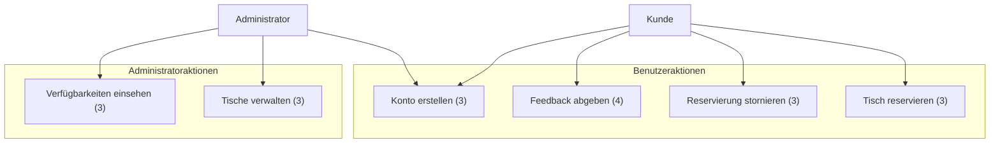

# Restaurant Buchungssystem - Software Requirements Specification

## Inhaltsverzeichnis
1. [Einführung](#1-einführung)  
   1.1 [Zweck](#11-zweck)  
   1.2 [Umfang](#12-umfang)  
   1.3 [Definitionen, Akronyme und Abkürzungen](#13-definitionen-akronyme-und-abkürzungen)  
   1.4 [Referenzen](#14-referenzen)  
   1.5 [Überblick](#15-überblick)  
2. [Gesamtbeschreibung](#2-gesamtbeschreibung)  
   2.1 [Produktperspektive](#21-produktperspektive)  
   2.2 [Produktfunktionen](#22-produktfunktionen)  
   2.3 [Benutzermerkmale](#23-benutzermerkmale)  
   2.4 [Einschränkungen](#24-einschränkungen)  
   2.5 [Annahmen und Abhängigkeiten](#25-annahmen-und-abhängigkeiten)  
   2.6 [Anforderungen der Teilmengen](#26-anforderungen-der-teilmengen)  
   2.7 [Use Case Diagramm](#27-use-case-diagramm)  
3. [Spezifische Anforderungen](#3-spezifische-anforderungen)  
   3.1 [Funktionalität](#31-funktionalität)  
   3.2 [Benutzbarkeit](#32-benutzbarkeit)  
   3.3 [Zuverlässigkeit](#33-zuverlässigkeit)  
   3.4 [Leistung](#34-leistung)  
   3.5 [Unterstützbarkeit](#35-unterstützbarkeit)  
   3.6 [Design-Beschränkungen](#36-design-beschränkungen)  
   3.7 [Online-Benutzerdokumentation und Hilfesystemanforderungen](#37-online-benutzerdokumentation-und-hilfesystemanforderungen)  
   3.8 [Gekaufte Komponenten](#38-gekaufte-komponenten)  
   3.9 [Schnittstellen](#39-schnittstellen)  
   3.10 [Lizenzierungsanforderungen](#310-lizenzierungsanforderungen)  
   3.11 [Rechtliche, urheberrechtliche und andere Hinweise](#311-rechtliche-urheberrechtliche-und-andere-hinweise)  
   3.12 [Anwendbare Standards](#312-anwendbare-standards)  
4. [Unterstützende Informationen](#4-unterstützende-informationen)  

## 1. Einführung  

### 1.1 Zweck  
Der Zweck dieser Software Requirements Specification (SRS) ist es, eine klare und umfassende Beschreibung der Anforderungen für das Restaurant-Buchungssystem bereitzustellen. Sie beschreibt das externe Verhalten des Systems und gibt sowohl funktionale als auch nicht-funktionale Anforderungen vor. Die SRS dient als zentrale Referenz für alle Beteiligten und stellt sicher, dass die Anforderungen an die Software klar und nachvollziehbar dokumentiert sind.

### 1.2 Umfang  
Das Restaurant-Buchungssystem wird als Webanwendung entwickelt. Diese Anwendung ermöglicht Benutzern (Kunden), Reservierungen vorzunehmen, und Administratoren (Restaurantmitarbeitern), Tische und Reservierungen zu verwalten.
- Benutzer (Kunden): Können verfügbare Tische einsehen, Reservierungen vornehmen, stornieren und Feedback hinterlassen.
- Administratoren: Verwalten die Tische, sehen Reservierungen ein und bearbeiten sie.
Das System wird mit C#, ASP.NET, HTML, JavaScript/TypeScript und CSS umgesetzt und verwendet eine SQL-Datenbank zur Speicherung der Daten.

### 1.3 Definitionen, Akronyme und Abkürzungen  
- **SRS (Software Requirements Specification)**: Ein Dokument, das die Anforderungen an eine Softwareanwendung beschreibt.
- **Benutzer**: Eine Person, die die Webanwendung verwendet, um Reservierungen vorzunehmen und Informationen über verfügbare Tische abzurufen.
- **Administrator**: Ein Mitarbeiter des Restaurants, der das System verwaltet, Tische erstellt und Reservierungen einsehen kann.
- **Tischplan**: Eine grafische Darstellung der verfügbaren Tische in einem Restaurant, die Benutzern zeigt, welche Tische frei oder reserviert sind.
- **Reservierung**: Der Vorgang, bei dem ein Benutzer einen Tisch für einen bestimmten Zeitpunkt reserviert, um sicherzustellen, dass der Tisch zur gewünschten Zeit verfügbar ist.
- **SQL (Structured Query Language)**: Eine standardisierte Programmiersprache zur Verwaltung und Abfrage von Daten in relationalen Datenbanken.
- **ASP.NET**: Ein Framework von Microsoft zur Entwicklung von Webanwendungen und Webdiensten.
- **HTML (Hypertext Markup Language)**: Eine Markup-Sprache zur Strukturierung und Darstellung von Inhalten im Web.
- **CSS (Cascading Style Sheets)**: Eine Stylesheet-Sprache zur Gestaltung von HTML-Inhalten, die das Aussehen und Layout von Webseiten definiert.
- **JavaScript/TypeScript**: Programmiersprachen, die verwendet werden, um interaktive und dynamische Inhalte auf Webseiten zu erstellen.

### 1.4 Referenzen  
Die folgende Liste enthält alle Dokumente und Quellen, auf die im Rahmen dieser Software Requirements Specification (SRS) verwiesen wird:
1. **Template von RUP SRS**  
   Titel: RUP Software Requirements Specification (SRS) Template  
   Link: [RUP SRS Template](https://sceweb.sce.uhcl.edu/helm/REQ_ENG_WEB/My-Files/mod4/rup_srs.dot)
2. **Projektdokumentation**  
   Titel: Restaurant Buchungssystem – Projektdokumentation  
   Autoren: Alina Moumen, Yahya, Alex, Lukas  
   Link: [Dokumentation auf GitHub](https://github.com/AlinaBoess/SoftwareEngineeringProjektTINF23B5/tree/main/documentation)  
3. **Code-Repository**  
   Titel: Restaurant Buchungssystem – Code-Repository  
   Autoren: Alina Moumen, Yahya, Alex, Lukas  
   Link: [Code auf GitHub](https://github.com/AlinaBoess/SoftwareEngineeringProjektTINF23B5/tree/main/programCode)  
4. **Blog**  
   Titel: Restaurant Buchungssystem – Wöchentliche Blog-Beiträge  
   Autoren: Alina Moumen, Yahya, Alex, Lukas  
   Link: [Blog auf GitHub Discussions](https://github.com/AlinaBoess/SoftwareEngineeringProjektTINF23B5/discussions)  

### 1.5 Überblick 
Dieses Dokument ist eine Software Requirements Specification (SRS) für das Restaurant Buchungssystem. Es beschreibt die Anforderungen, die zur Entwicklung der Anwendung erforderlich sind, sowie deren Funktionalität und nicht-funktionale Eigenschaften.
Die SRS ist in die folgenden Hauptabschnitte gegliedert:
1. **Einführung**: Dieser Abschnitt bietet einen Überblick über die Ziele und den Umfang des Dokuments sowie wichtige Definitionen und Referenzen.
2. **Gesamtbeschreibung**: Hier werden die allgemeine Funktionsweise des Systems, die Hauptakteure und deren Interaktionen mit dem System erläutert. Auch werden die wichtigsten Features und Teilsysteme des Restaurant Buchungssystems vorgestellt.
3. **Spezifische Anforderungen**: In diesem Abschnitt werden die detaillierten funktionalen und nicht-funktionalen Anforderungen an das System aufgeführt. Dazu gehören unter anderem Anforderungen an die Benutzeroberfläche, Datenverwaltung, Sicherheitsanforderungen und Performance.
4. **Unterstützende Informationen**: Hier werden zusätzliche Informationen bereitgestellt, die für das Verständnis der SRS relevant sein könnten, einschließlich Glossar, Abkürzungen und andere nützliche Hinweise.
Diese Struktur soll sicherstellen, dass alle Aspekte des Restaurant Buchungssystems klar und umfassend dokumentiert sind, um eine effektive Entwicklung und Implementierung der Software zu ermöglichen.

## 2. Gesamtbeschreibung  

### 2.1 Produktperspektive
Das Restaurant-Buchungssystem ist eine Webanwendung, die als eigenständiges System entwickelt wird. Es ersetzt bisher manuelle oder telefonisch durchgeführte Buchungen durch ein automatisiertes Online-System. Dies verbessert die Effizienz und Benutzerfreundlichkeit, indem es den Benutzern ermöglicht, Reservierungen unabhängig von der Verfügbarkeit des Personals zu verwalten.

Das System ist in die bereits bestehende IT-Infrastruktur des Restaurants integrierbar und arbeitet auf Servern, die die Datenbank und die Webanwendung hosten. Benutzer greifen über Webbrowser auf das System zu. Die Anwendung ist modular aufgebaut, sodass zukünftige Erweiterungen, wie etwa die Integration eines Zahlungssystems, möglich sind.

### 2.2 Produktfunktionen
Das System umfasst folgende Kernfunktionen:
- **Tischverwaltung:** Administratoren können Tische erstellen, konfigurieren und deren Verfügbarkeit anzeigen. Diese Funktion bietet eine Übersicht über den Restaurantgrundriss und zeigt, welche Tische verfügbar oder reserviert sind.
- **Reservierungssystem:** Benutzer können verfügbare Tische und Zeitfenster einsehen und Reservierungen vornehmen. Dazu gehört auch die Möglichkeit, bestehende Reservierungen zu stornieren oder zu ändern.
- **Benutzersystem:** Sowohl Benutzer als auch Administratoren müssen ein Konto erstellen, um auf das System zuzugreifen. Benutzerinformationen werden in einer Datenbank gespeichert, um die Reservierungen mit spezifischen Benutzern zu verknüpfen.
- **Feedbacksystem:** Nach einer Reservierung können Benutzer Feedback zur Reservierung und ihrer Erfahrung im Restaurant abgeben.

### 2.3 Benutzermerkmale
Es gibt zwei Hauptakteure, die das System nutzen:
- **Benutzer (Kunden):** Sie sind die primären Nutzer des Systems. Sie erwarten eine einfache und intuitive Möglichkeit, Tische zu reservieren, zu stornieren und ihre Reservierungen zu verwalten. Benutzer benötigen minimale technische Kenntnisse, da die Anwendung benutzerfreundlich gestaltet ist. Sie müssen ein Konto erstellen, um Reservierungen zu tätigen.
- **Administratoren (Restaurantmitarbeiter):** Administratoren verwalten Tische und sehen Reservierungen ein. Sie haben zusätzliche Berechtigungen, um Tische hinzuzufügen, Zeitfenster zu ändern und überbuchte Zeiten zu verwalten. Sie benötigen grundlegende Kenntnisse der Anwendung und Zugriff auf das Backend der Webanwendung.

### 2.4 Einschränkungen
- **Technische Einschränkungen:** Das System muss in einer Webumgebung laufen und wird in C#, ASP.NET, HTML, JavaScript/TypeScript und CSS entwickelt. Eine SQL-Datenbank wird zur Speicherung der Daten verwendet. Es gibt Einschränkungen hinsichtlich der Serverkapazitäten und der Netzwerklatenz, die die Performance beeinflussen können.
- **Sicherheitsanforderungen:** Da persönliche Daten und Reservierungen verarbeitet werden, müssen Datenschutzrichtlinien wie die DSGVO eingehalten werden. Besonders die Speicherung von Benutzerdaten muss den gängigen Sicherheitsstandards entsprechen.
- **Systemverfügbarkeit:** Das System muss nahezu rund um die Uhr verfügbar sein, um Kunden die Möglichkeit zu geben, jederzeit Reservierungen vorzunehmen. Wartungszeiten müssen minimal und im Voraus angekündigt werden.

### 2.5 Annahmen und Abhängigkeiten
- **Internetverbindung:** Es wird angenommen, dass Benutzer und Administratoren über eine stabile Internetverbindung verfügen, um die Webanwendung effektiv nutzen zu können.
- **Server-Infrastruktur:** Die Anwendung setzt eine stabile Serverumgebung voraus, um eine hohe Verfügbarkeit und eine reibungslose Performance sicherzustellen.
- **Hardware-Abhängigkeiten:** Es wird davon ausgegangen, dass sowohl die Benutzer als auch die Administratoren über Endgeräte (PCs, Tablets, Smartphones) verfügen, die einen modernen Webbrowser unterstützen.
- **Zukunftssicherheit:** Das System sollte so entwickelt werden, dass es in Zukunft leicht um zusätzliche Funktionen erweitert werden kann, z. B. die Integration eines Zahlungssystems oder einer mobilen App.

### 2.6 Anforderungen der Teilmengen
Das System umfasst verschiedene Teilmengen von Anforderungen:
- **Kernanforderungen:** Diese betreffen die grundlegenden Funktionen wie die Reservierung und die Verwaltung von Tischen.
- **Erweiterte Anforderungen:** Dazu gehören Funktionen wie Feedback, Benachrichtigungen und mögliche zukünftige Erweiterungen.
- **Sicherheitsanforderungen:** Diese betreffen den Schutz der Benutzerdaten und die Einhaltung von Datenschutzrichtlinien.
  
### 2.7 Use Case Diagramm

3 wird dieses und 4 nächstes Semester gemacht.
- Tischreservierung: Der Benutzer wählt einen verfügbaren Tisch und eine Zeit aus und reserviert diesen.
- Tischverwaltung: Administratoren können Tische erstellen, bearbeiten und deren Verfügbarkeit einsehen.
- Stornierung von Reservierungen: Benutzer können bestehende Reservierungen stornieren.
- Feedback abgeben: Nach einer Reservierung können Benutzer Feedback zu ihrer Erfahrung geben.
- Kontoerstellung: Sowohl Benutzer als auch Administratoren müssen ein Konto erstellen, um das System zu nutzen.

## 3. Spezifische Anforderungen  
### 3.1 Funktionalität  
### 3.2 Benutzbarkeit  
### 3.3 Zuverlässigkeit  
### 3.4 Leistung  
### 3.5 Unterstützbarkeit  
### 3.6 Design-Beschränkungen  
### 3.7 Online-Benutzerdokumentation und Hilfesystemanforderungen  
### 3.8 Gekaufte Komponenten  
### 3.9 Schnittstellen  
### 3.10 Lizenzierungsanforderungen  
### 3.11 Rechtliche, urheberrechtliche und andere Hinweise  
### 3.12 Anwendbare Standards  

## 4. Unterstützende Informationen  
