# Softwarearchitektur-Dokument

## Inhaltsverzeichnis
- [1. Einleitung](#1-einleitung)
  - [1.1 Zweck](#11-zweck)
  - [1.2 Anwendungsbereich](#12-anwendungsbereich)
  - [1.3 Begriffe, Akronyme und Abkürzungen](#13-begriffe-akronyme-und-abkürzungen)
  - [1.4 Referenzen](#14-referenzen)
  - [1.5 Überblick](#15-überblick)
- [2. Architekturdarstellung](#2-architekturdarstellung)
  - [2.1 Architekturübersicht](#21-architekturübersicht)
  - [2.2 Architekturstile und -muster](#22-architekturstile-und-muster)
- [3. Ziele und Einschränkungen](#3-ziele-und-einschränkungen)
- [4. Anwendungsfallansicht](#4-anwendungsfallansicht)
- [5. Logische Ansicht](#5-logische-ansicht)
- [6. Prozessansicht](#6-prozessansicht)
- [7. Bereitstellungsansicht](#7-bereitstellungsansicht)
- [8. Implementierungsansicht](#8-implementierungsansicht)
  - [8.1 Continuous Integration / Continuous Deployment (CI/CD)](#81-continuous-integration-continuous-deployment-cicd)
- [9. Datenansicht](#9-datenansicht)
  - [9.1 Datenbankmodell](#91-datenbankmodell)
  - [9.2 Performance-Optimierung](#92-performance-optimierung)
- [10. Qualität](#10-qualität)
  - [10.1 Teststrategie](#101-teststrategie)
  - [10.2 Sicherheitsaspekte](#102-sicherheitsaspekte)
---

## 1. Einleitung
### 1.1 Zweck
Beschreibt den Zweck des Dokuments und definiert, wie es im Kontext des Projekts genutzt wird. Identifiziert die Zielgruppe und deren erwarteten Nutzen.

### 1.2 Anwendungsbereich
Umreißt, für welche Systeme, Komponenten oder Anwendungen dieses Dokument gilt.

### 1.3 Begriffe, Akronyme und Abkürzungen
Definiert relevante Begriffe, Abkürzungen und Akronyme, um ein einheitliches Verständnis sicherzustellen.

### 1.4 Referenzen
Listet relevante Dokumente, Links oder andere Quellen, die im Dokument zitiert oder referenziert werden.

### 1.5 Überblick
Bietet einen Überblick über den Inhalt und die Struktur des Dokuments.

---

## 2. Architekturdarstellung
Beschreibt die gewählte Darstellungsform der Softwarearchitektur (z. B. MVC, MVVM) und die eingesetzten Ansichten. Erklärt, wie verschiedene Modellkomponenten repräsentiert werden.

---

## 3. Ziele und Einschränkungen der Architektur
Definiert die architektonischen Hauptziele, Anforderungen und Beschränkungen, z. B. in Bezug auf Sicherheit, Skalierbarkeit, Portabilität oder die Nutzung bestehender Technologien.

### Architektonische Ziele

Die Softwareanforderungen und -ziele:

- **Sicherheit**: Schutz sensibler Benutzer- und Reservierungsdaten vor unbefugtem Zugriff.
- **Datenschutz**: Einhaltung von Datenschutzrichtlinien, um Benutzerdaten vertraulich und sicher zu behandeln.
- **Wiederverwendbarkeit**: Modularer Aufbau der Architektur, um zukünftige Erweiterungen wie Zahlungsintegrationen zu ermöglichen.
- **Portabilität**: Sicherstellung, dass die Webanwendung auf verschiedenen Geräten (Desktop, Tablet, Smartphone) einwandfrei funktioniert.
- **Verfügbarkeit**: Gewährleistung einer Systemverfügbarkeit von mindestens 99,5 %, auch bei hohen Nutzerzahlen.

### Einschränkungen

Die spezielle Bedingungen und Beschränkungen, die sich auf das Design und die Implementierung auswirken:

- **Entwicklungstools**: Nutzung von Visual Studio, ASP.NET Core und SQL-Datenbanken als feste technologische Grundlage.
- **Teamstruktur und Zeitplan**: Umsetzung des Projekts durch ein kleines Entwicklerteam mit einem engen Zeitrahmen und begrenzten Ressourcen.
- **Legacy Code**: Integration bestehender Komponenten und Anpassung an neue Anforderungen.
- **Verteilung**: Sicherstellung einer effizienten Datenverteilung zwischen Frontend und Backend.

---

## 4. Anwendungsfallansicht
### 4.1 Realisierungen von Anwendungsfällen
Stellt ausgewählte Anwendungsfälle dar, die die Funktionsweise des Systems illustrieren, und beschreibt deren Realisierung durch architektonische Komponenten.

---

## 5. Logische Ansicht
### 5.1 Überblick
Beschreibt die logische Struktur des Systems, z. B. die Aufteilung in Subsysteme, Schichten oder Pakete.

### 5.2 Architektonisch signifikante Design-Pakete
Detailliert wichtige Pakete, Klassen und deren Beziehungen. Enthält Diagramme zur Veranschaulichung.

---

## 6. Prozessansicht
Dieser Abschnitt enthält Sequenzdiagramme, die die Interaktion zwischen den verschiedenen Akteuren und Systemkomponenten für die wichtigsten Anwendungsfälle darstellen.

### 6.1 Sequenzdiagramme

#### 1. **Anmelden (Benutzer)**
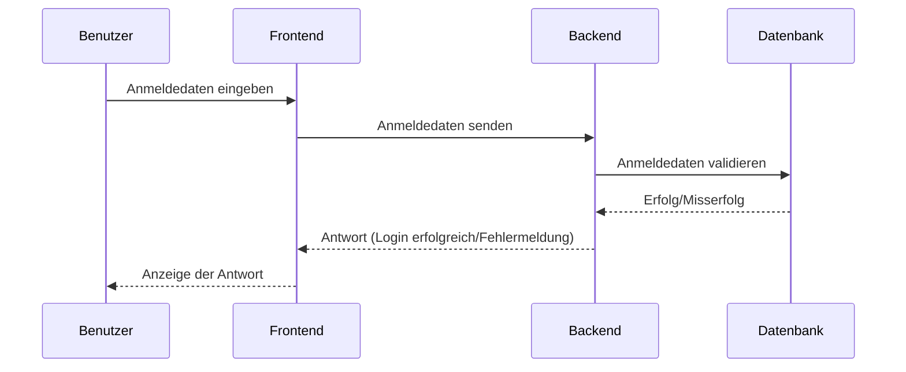

#### 2. **Konto erstellen**
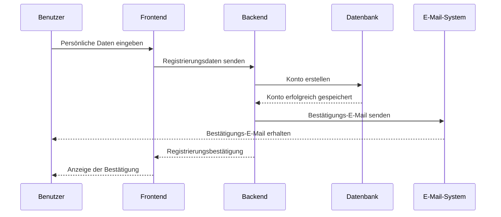

#### 3. **Tisch reservieren**
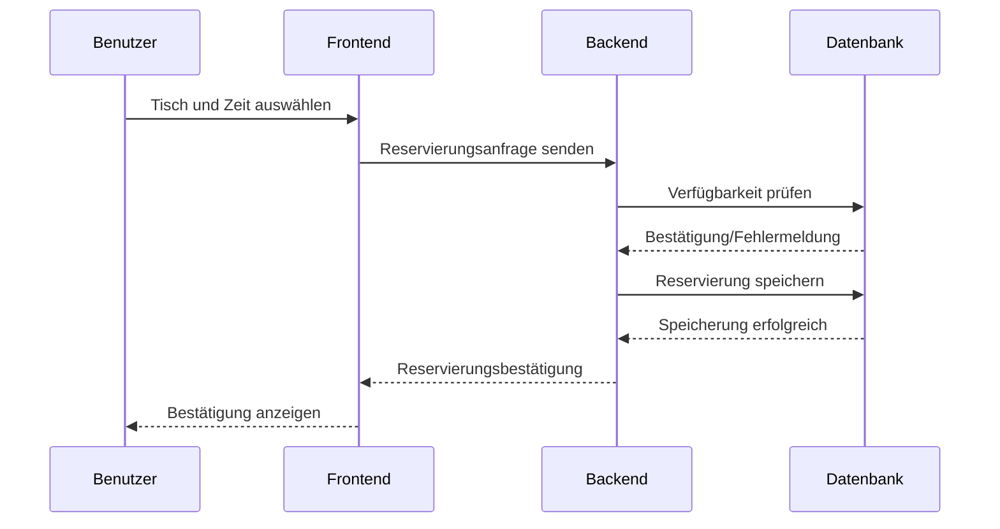

#### 4. **Reservierungsbestätigung anzeigen**
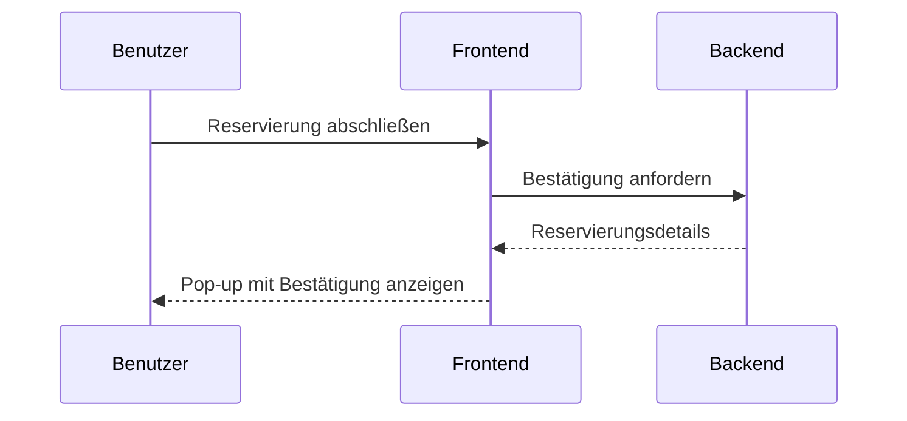

#### 5. **Reservierung stornieren**
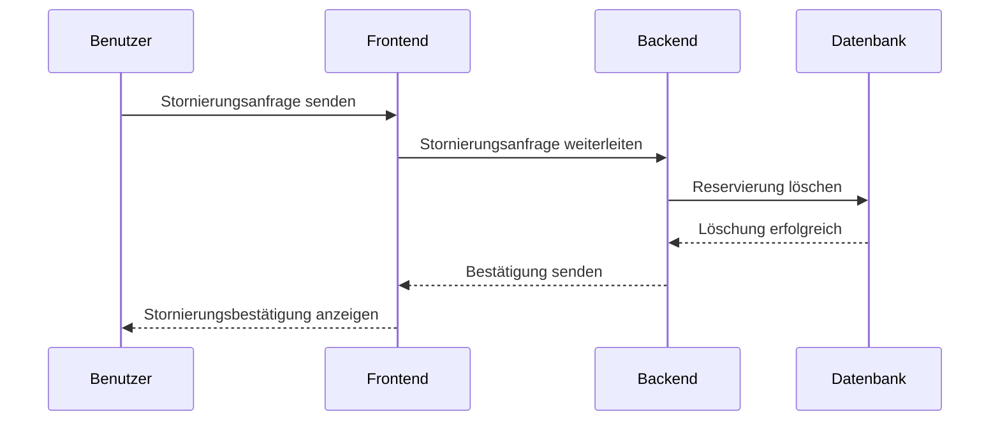

#### 6. **Feedback geben**
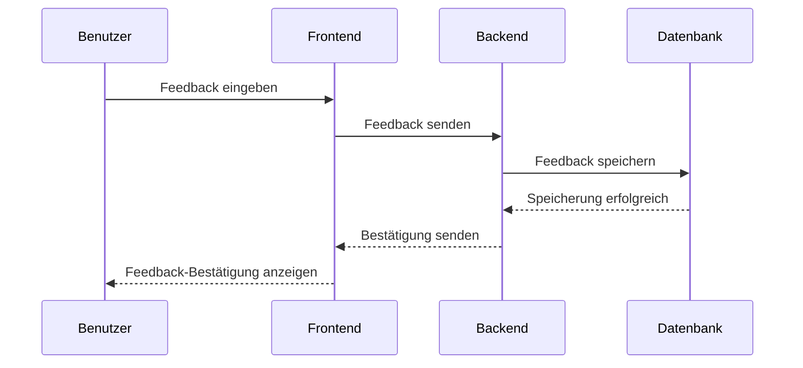

#### 7. **Reservierungen einsehen**
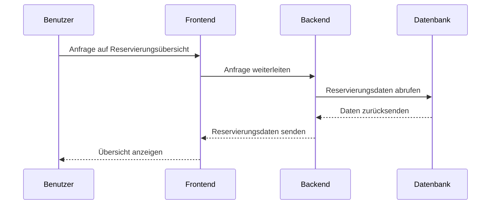

#### 8. **Anmelden (Administrator)**
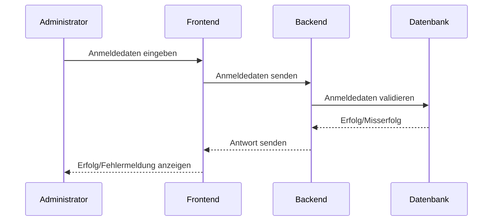

#### 9. **Tischverwaltung**
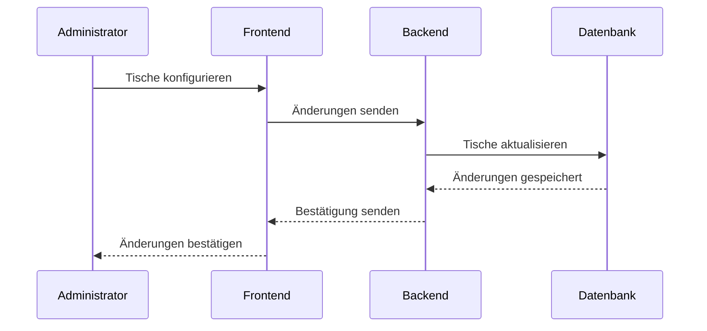

#### 10. **Reservierungsübersicht (Administrator)**
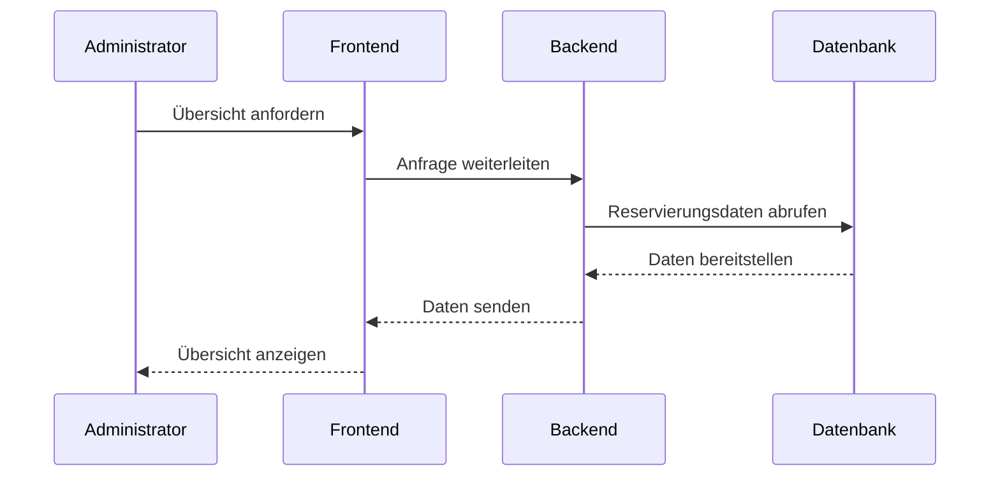

#### 11. **Feedback einsehen (Administrator)**
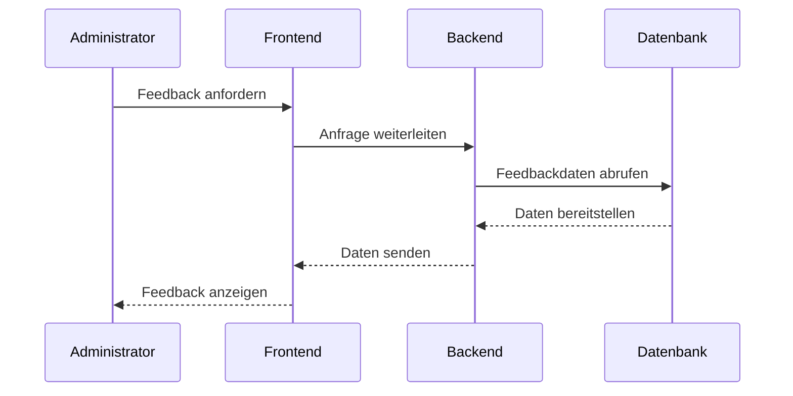

---

## 7. Bereitstellungsansicht
Zeigt die physische Bereitstellung der Software auf Hardware-Ressourcen. Beschreibt Netzwerkkonfigurationen und die Zuordnung von Softwarekomponenten zu Hardware-Knoten.

---

## 8. Implementierungsansicht
### 8.1 Überblick
Beschreibt die Implementierungsstruktur, z. B. Schichten oder Subsysteme, und deren Zusammenspiel.

### 8.2 Schichten
Detailliert die einzelnen Schichten und deren Verantwortlichkeiten. Ergänzt durch Diagramme.

---

## 9. Datenansicht (optional)
Beschreibt die persistente Datenstruktur des Systems, z. B. durch Datenbank- oder ER-Diagramme.

---

## 10. Größe und Leistung
Erörtert Anforderungen an Skalierbarkeit, Speicherverbrauch und Leistung sowie die zu erwartenden Dimensionen des Systems.

---

## 11. Qualität
Unsere Software-Architektur spielt bei vielen Fähigkeiten des Systems eine wesentliche Rolle; nachstehend wird jede der betrachteten Fähigkeiten aufgezählt und deren Auswirkungen auf unser Projekt detailliert beschrieben, um dem Leser unsere Archtekturtaktik näherzubringen:

- Erweiterbarkeit

Die Wahl von Technologien wie C# mit ASP.NET Core und eine modulare Architektur ermöglichen das Hinzufügen neuer Funktionen, wie z. B. erweiterte Reservierungsfunktionen oder zusätzliche Funktionen für die Restaurantverwaltung, ohne größere Nacharbeiten. Das Team verwendet außerdem Jira für die Backlog-Verwaltung, was eine einfache Integration neuer Aufgaben in den Workflow ermöglicht.

- Verlässlichkeit

Die Verwendung von robusten Frameworks (z. B. ASP.NET Core) gewährleistet eine starke Unterstützung für Fehlerbehandlung und Ausfallsicherheit. Scrum-Praktiken, einschließlich Sprint-Reviews und Retrospektiven, helfen dabei, Probleme iterativ zu identifizieren und zu beheben, was die Zuverlässigkeit des Systems im Laufe der Zeit erhöht.

- Übertragbarkeit

Durch die Entwicklung mit HTML, CSS, JavaScript/TypeScript für das Frontend kann die Anwendung auf verschiedenen Webbrowsern eingesetzt werden, was die Zugänglichkeit auf unterschiedlichen Geräten gewährleistet. Die Verwendung von Standardtools wie GitHub unterstützt die Portabilität zusätzlich, indem sie eine nahtlose Bereitstellung und Zusammenarbeit in verschiedenen Umgebungen ermöglicht.
Sicherheit

- Obwohl nicht explizit beschrieben, bietet die Verwendung von ASP.NET Core in der Architektur integrierte Sicherheitsfunktionen wie Authentifizierung und Datenschutz. Diese helfen, sensible Reservierungsdaten zu schützen.

- Benutzerfreundlichkeit und Datenschutz

Das geplante Feedback-System und das klare Design der Benutzeroberfläche zielen darauf ab, die Benutzerfreundlichkeit zu verbessern. Der Datenschutz wird zwar nicht explizit erwähnt, aber die Verwendung moderner Frameworks lässt vermuten, dass das Projekt den sicheren Umgang mit Benutzerdaten effektiv einbeziehen kann.

Diese Merkmale stehen im Einklang mit dem Ansatz unseres Teams zur iterativen Entwicklung und heben besonders die Adaptierbarkeit, Sicherheit und Effizienz des bestehenden Systems durch dessen Lebenszyklus hervor.

# 1. Einleitung  

## 1.1 Zweck  

Dieses Dokument beschreibt die Softwarearchitektur der Tischreservierungsanwendung. Es dient als Leitfaden für Entwickler, Architekten und andere Beteiligte, um ein gemeinsames Verständnis der Systemstruktur zu gewährleisten.  

Das Dokument hilft dabei:  

- Architekturentscheidungen nachvollziehbar zu machen  
- Die wichtigsten Komponenten und deren Zusammenhänge darzustellen  
- Die Basis für zukünftige Weiterentwicklungen und Wartungen zu legen  

**Zielgruppe:** Softwareentwickler, Architekten und technische Projektbeteiligte.  

## 1.2 Anwendungsbereich  

Die Tischreservierungsanwendung ist ein webbasiertes System zur Reservierung von Tischen in Restaurants.  

### Hauptkomponenten:  

- **Frontend:** Benutzeroberfläche für Gäste und Administratoren (Angular)  
- **Backend:** Serverseitige Logik zur Verarbeitung von Reservierungen und Nutzerdaten (ASP.NET Core)  
- **Datenbank:** Speicherung von Benutzer-, Reservierungs- und Restaurantdaten (MariaDB)  

**Zielgruppe:** Restaurantbesitzer und Kunden, die Tischreservierungen vornehmen oder verwalten möchten.  

## 1.3 Begriffe, Akronyme und Abkürzungen  

| Begriff | Bedeutung |  
|---------|----------|  
| API | Schnittstelle für den Datenaustausch zwischen Systemen |  
| CRUD | Create, Read, Update, Delete – Grundoperationen für Datenbanken |  

## 1.4 Referenzen  

Das GitHub-Repository enthält den Quellcode und weiterführende Informationen:  
[GitHub Repository](Hier könnte ein Link eingefügt werden.)  

## 1.5 Überblick  

Dieses Dokument beschreibt die Softwarearchitektur der Tischreservierungsanwendung und deckt folgende Aspekte ab:  

- Architekturziele und Einschränkungen (Kapitel 3)  
- Wichtige Anwendungsfälle (Kapitel 4)  
- Logische, Prozess- und Implementierungssicht (Kapitel 5–8)  
- Datenmodell (Kapitel 9)  
- Qualitätsanforderungen (Kapitel 11)  

Es dient als Referenz für Entwickler und als Grundlage für zukünftige Erweiterungen.  

---

# 2. Architekturdarstellung  

Die Architektur der Tischreservierungsanwendung basiert auf dem **MVC-Modell (Model-View-Controller)**:  

- **Model:** MariaDB-Datenbank und Geschäftslogik in ASP.NET Core. Hier werden Reservierungen, Benutzerdaten und Geschäftsprozesse verwaltet.  
- **View:** Benutzeroberfläche in Angular zur Darstellung der UI.  
- **Controller:** ASP.NET Core verarbeitet API-Anfragen und steuert die Geschäftslogik.  

### Eingesetzte Ansichten:  

- **Logische Sicht:** Zeigt die Hauptkomponenten und deren Beziehungen.  
- **Prozesssicht:** Beschreibt die Laufzeitinteraktion der Komponenten.  
- **Implementierungssicht:** Zeigt die Struktur des Codes und die Organisation in Module.  
- **Bereitstellungssicht:** Beschreibt die Verteilung der Software auf Hardware.  

Diese Architektur sorgt für eine klare Trennung von Daten, Darstellung und Geschäftslogik und ermöglicht eine skalierbare, wartbare Anwendung.  

---

# 4. Anwendungsfallansicht  

## 4.1 Realisierung von Anwendungsfällen  

Dieses Kapitel beschreibt die wichtigsten Anwendungsfälle und deren technische Umsetzung.  

### **Benutzerregistrierung**  

1. Nutzer gibt Registrierungsdaten in der Angular-App ein.  
2. Daten werden an die ASP.NET Core API gesendet.  
3. Backend validiert die Eingaben und speichert sie in MariaDB.  
4. Nutzer erhält eine Bestätigung der Registrierung.  

### **Tischreservierung**  

1. Nutzer wählt ein Restaurant und die gewünschte Uhrzeit.  
2. Anfrage wird an die ASP.NET Core API gesendet.  
3. Backend prüft die Verfügbarkeit und speichert die Reservierung.  
4. Nutzer erhält eine Bestätigung.  

### **Feedback geben**  

1. Nutzer gibt Bewertung in der Angular-App ein.  
2. Daten werden an die ASP.NET Core API gesendet.  
3. Feedback wird in MariaDB gespeichert und ist für andere sichtbar.  

---

# 5. Logische Ansicht  

## 5.1 Überblick  

Das System ist in drei Hauptschichten unterteilt:  

| Schicht | Technologie | Funktion |  
|---------|------------|----------|  
| Präsentationsschicht | Angular (HTML, CSS, TypeScript) | UI und Interaktion |  
| Anwendungsschicht | ASP.NET Core (C#) | Geschäftslogik und API-Endpoints |  
| Datenzugriffsschicht | MariaDB | Speicherung und Abfragen von Daten |  

## 5.2 Architektonisch signifikante Design-Pakete  

### **Frontend (Angular)**  

- Komponenten zur UI-Darstellung  
- Services zur API-Kommunikation  
- Routing und State-Management  

### **Backend (ASP.NET Core)**  

- **Controller:** API-Endpunkte  
- **Services:** Geschäftslogik  
- **Repositories:** Datenbankzugriff  

### **Datenbank (MariaDB)**  

- Speicherung von Benutzer-, Reservierungs- und Feedback-Daten  
- Nutzung von ORM (Entity Framework Core)  

---

# 7. Bereitstellungsansicht  

Das System wird auf separaten Servern bereitgestellt:  

### **Hardware-Zuordnung**  

- **Frontend (Angular):** Läuft auf einem Webserver (Nginx, Apache).  
- **Backend (ASP.NET Core):** Läuft auf einem Applikationsserver (IIS, Docker).  
- **MariaDB:** Wird auf einem dedizierten Datenbankserver gehostet.  

---

# 8. Implementierungsansicht  

## 8.1 Überblick  

Das System folgt einer mehrschichtigen Architektur:  

- **Präsentationsschicht (Angular)**  
- **Anwendungsschicht (ASP.NET Core)**  
- **Datenzugriffsschicht (MariaDB)**  

## 8.2 Schichten  

| Schicht | Verantwortlichkeiten |  
|---------|----------------------|  
| Präsentationsschicht | UI-Komponenten, API-Kommunikation |  
| Anwendungsschicht | Geschäftslogik, Sicherheitsmechanismen |  
| Datenzugriffsschicht | Datenbankabfragen, Repositories |  

---

# 9. Datenansicht  

Die Datenbankstruktur basiert auf **MariaDB** mit **Entity Framework Core** für ORM-Zugriffe.  

### **Wichtige Tabellen:**  

- **Benutzer** *(ID, Name, E-Mail, Passwort-Hash)*  
- **Reservierungen** *(ID, Benutzer-ID, Restaurant-ID, Datum, Uhrzeit)*  
- **Feedback** *(ID, Benutzer-ID, Bewertung, Kommentar)*  

10. Größe und Leistung 

Skalierbarkeit 

    Frontend: Skalierung über CDNs und Load Balancer. 

    Backend: Docker-Container für horizontale Skalierung. 

    Datenbank: Replikation und Sharding möglich. 

Speicherverbrauch 

    Frontend: Minimaler Speicherbedarf im Browser. 

    Backend: Hängt von API-Anfragen ab. 

    Datenbank: Speicherbedarf steigt mit Reservierungen. 

Leistungsanforderungen 

    API-Antwortzeit: < 200 ms 

    Caching: Redis oder MemoryCache zur Optimierung 

 
