# Softwarearchitektur-Dokument

## Inhaltsverzeichnis
- [1. Einleitung](#1-einleitung)
  - [1.1 Zweck](#11-zweck)
  - [1.2 Anwendungsbereich](#12-anwendungsbereich)
  - [1.3 Begriffe, Akronyme und Abkürzungen](#13-begriffe-akronyme-und-abkürzungen)
  - [1.4 Referenzen](#14-referenzen)
  - [1.5 Überblick](#15-überblick)
- [2. Architekturdarstellung](#2-architekturdarstellung)
- [3. Ziele und Einschränkungen der Architektur](#3-ziele-und-einschränkungen-der-architektur)
- [4. Anwendungsfallansicht](#4-anwendungsfallansicht)
  - [4.1 Realisierungen von Anwendungsfällen](#41-realisierungen-von-anwendungsfällen)
- [5. Logische Ansicht](#5-logische-ansicht)
  - [5.1 Überblick](#51-überblick)
  - [5.2 Architektonisch signifikante Design-Pakete](#52-architektonisch-signifikante-design-pakete)
- [6. Prozessansicht](#6-prozessansicht)
- [7. Bereitstellungsansicht](#7-bereitstellungsansicht)
- [8. Implementierungsansicht](#8-implementierungsansicht)
  - [8.1 Überblick](#81-überblick)
  - [8.2 Schichten](#82-schichten)
- [9. Datenansicht (optional)](#9-datenansicht-optional)
- [10. Größe und Leistung](#10-größe-und-leistung)
- [11. Qualität](#11-qualität)

---

## 1. Einleitung
### 1.1 Zweck
Beschreibt den Zweck des Dokuments und definiert, wie es im Kontext des Projekts genutzt wird. Identifiziert die Zielgruppe und deren erwarteten Nutzen.

### 1.2 Anwendungsbereich
Umreißt, für welche Systeme, Komponenten oder Anwendungen dieses Dokument gilt.

### 1.3 Begriffe, Akronyme und Abkürzungen
Definiert relevante Begriffe, Abkürzungen und Akronyme, um ein einheitliches Verständnis sicherzustellen.

### 1.4 Referenzen
Listet relevante Dokumente, Links oder andere Quellen, die im Dokument zitiert oder referenziert werden.

### 1.5 Überblick
Bietet einen Überblick über den Inhalt und die Struktur des Dokuments.

---

## 2. Architekturdarstellung
Beschreibt die gewählte Darstellungsform der Softwarearchitektur (z. B. MVC, MVVM) und die eingesetzten Ansichten. Erklärt, wie verschiedene Modellkomponenten repräsentiert werden.

---

## 3. Ziele und Einschränkungen der Architektur
Definiert die architektonischen Hauptziele, Anforderungen und Beschränkungen, z. B. in Bezug auf Sicherheit, Skalierbarkeit, Portabilität oder die Nutzung bestehender Technologien.

---

## 4. Anwendungsfallansicht
### 4.1 Realisierungen von Anwendungsfällen
Stellt ausgewählte Anwendungsfälle dar, die die Funktionsweise des Systems illustrieren, und beschreibt deren Realisierung durch architektonische Komponenten.

---

## 5. Logische Ansicht
### 5.1 Überblick
Beschreibt die logische Struktur des Systems, z. B. die Aufteilung in Subsysteme, Schichten oder Pakete.

### 5.2 Architektonisch signifikante Design-Pakete
Detailliert wichtige Pakete, Klassen und deren Beziehungen. Enthält Diagramme zur Veranschaulichung.

---

## 6. Prozessansicht
Dieser Abschnitt enthält Sequenzdiagramme, die die Interaktion zwischen den verschiedenen Akteuren und Systemkomponenten für die wichtigsten Anwendungsfälle darstellen.

### 6.1 Sequenzdiagramme

#### 1. **Anmelden (Benutzer)**
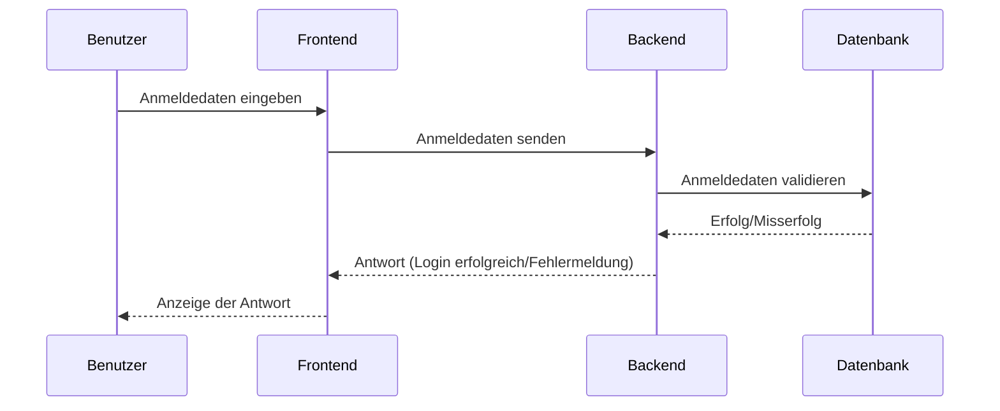

#### 2. **Konto erstellen**
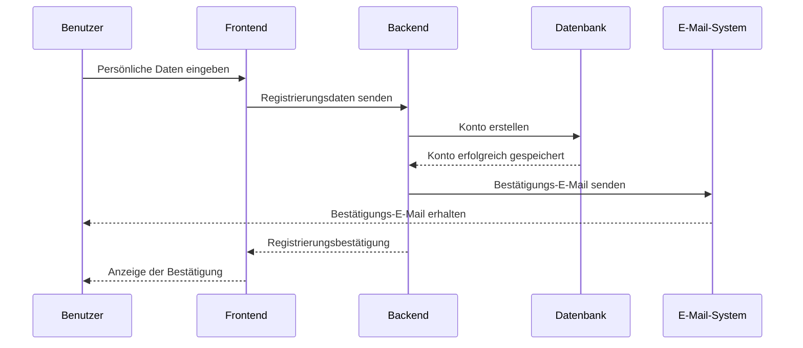

#### 3. **Tisch reservieren**
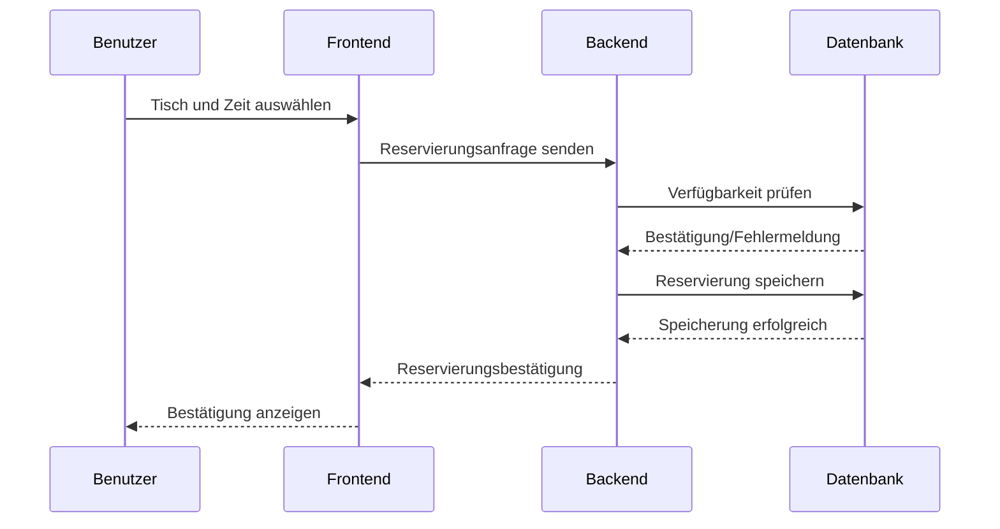

#### 4. **Reservierungsbestätigung anzeigen**
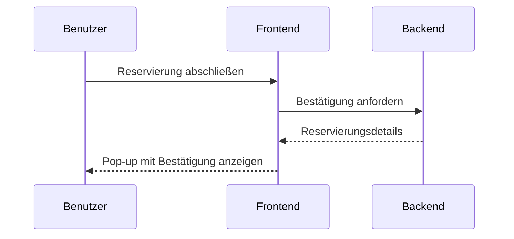

#### 5. **Reservierung stornieren**
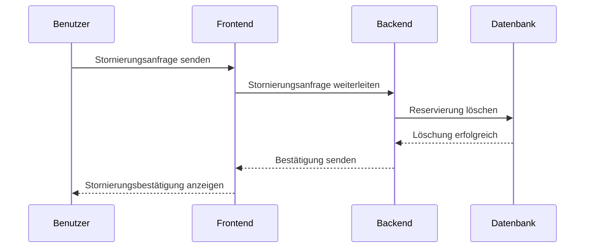

#### 6. **Feedback geben**
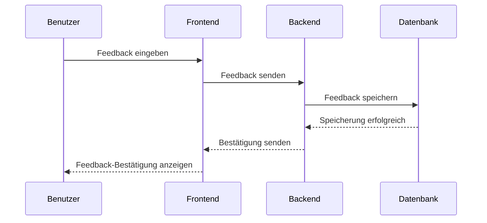

#### 7. **Reservierungen einsehen**
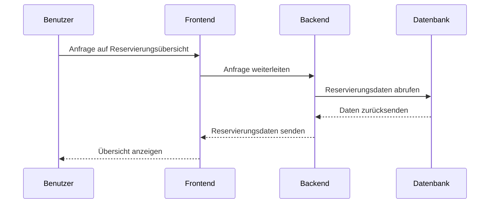

#### 8. **Anmelden (Administrator)**
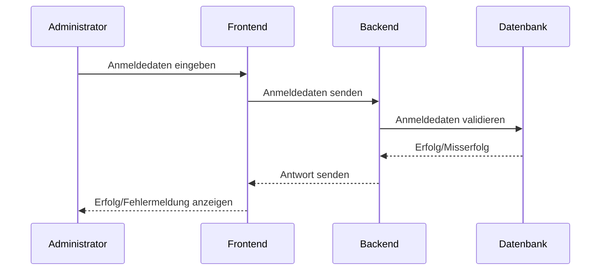

#### 9. **Tischverwaltung**
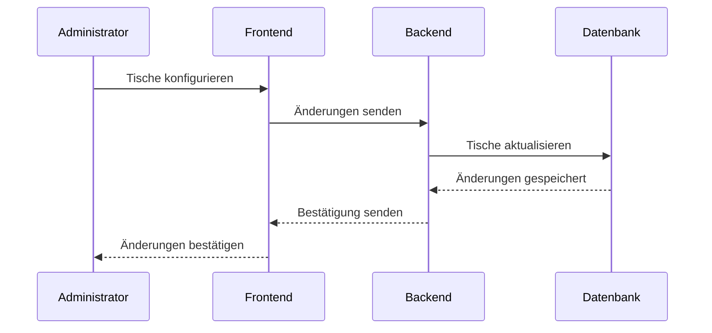

#### 10. **Reservierungsübersicht (Administrator)**
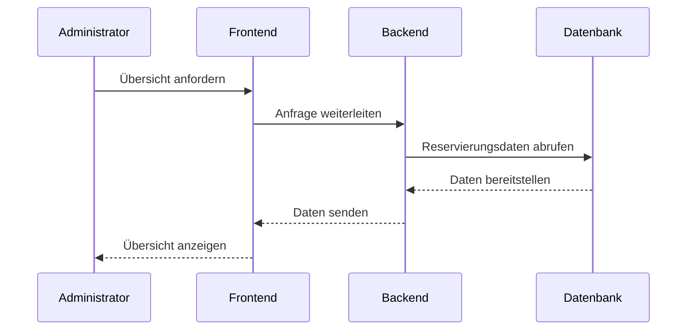

#### 11. **Feedback einsehen (Administrator)**
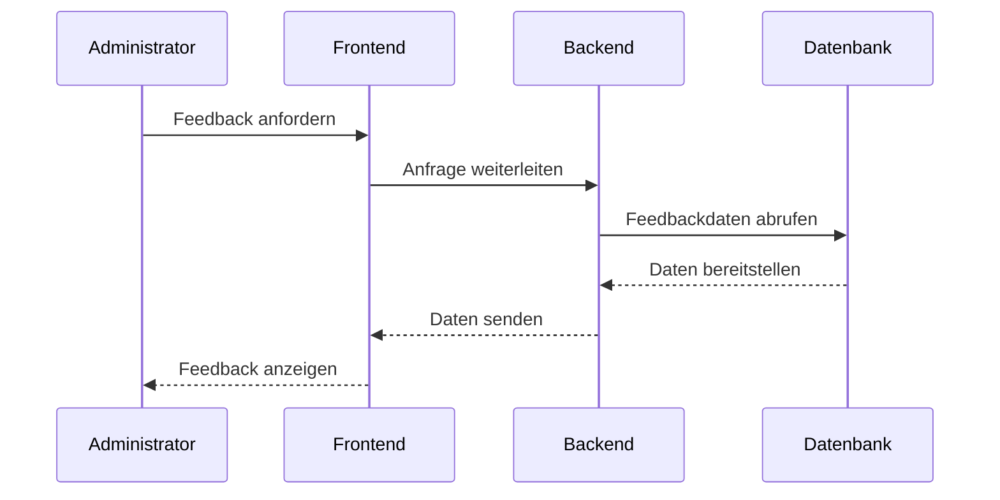

---

## 7. Bereitstellungsansicht
Zeigt die physische Bereitstellung der Software auf Hardware-Ressourcen. Beschreibt Netzwerkkonfigurationen und die Zuordnung von Softwarekomponenten zu Hardware-Knoten.

---

## 8. Implementierungsansicht
### 8.1 Überblick
Beschreibt die Implementierungsstruktur, z. B. Schichten oder Subsysteme, und deren Zusammenspiel.

### 8.2 Schichten
Detailliert die einzelnen Schichten und deren Verantwortlichkeiten. Ergänzt durch Diagramme.

---

## 9. Datenansicht (optional)
Beschreibt die persistente Datenstruktur des Systems, z. B. durch Datenbank- oder ER-Diagramme.

---

## 10. Größe und Leistung
Erörtert Anforderungen an Skalierbarkeit, Speicherverbrauch und Leistung sowie die zu erwartenden Dimensionen des Systems.

---

## 11. Qualität
Beschreibt, wie die Architektur die Qualitätsziele des Systems unterstützt, z. B. Wartbarkeit, Sicherheit, Erweiterbarkeit und Zuverlässigkeit.
