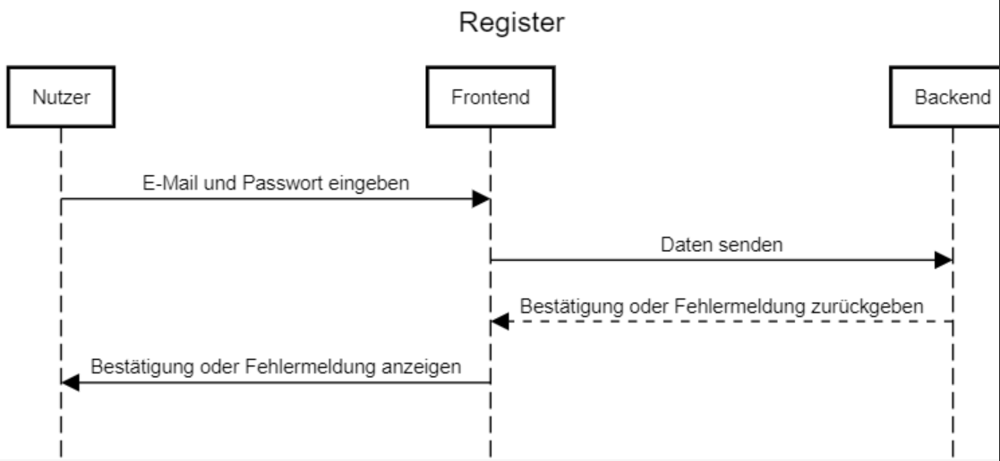
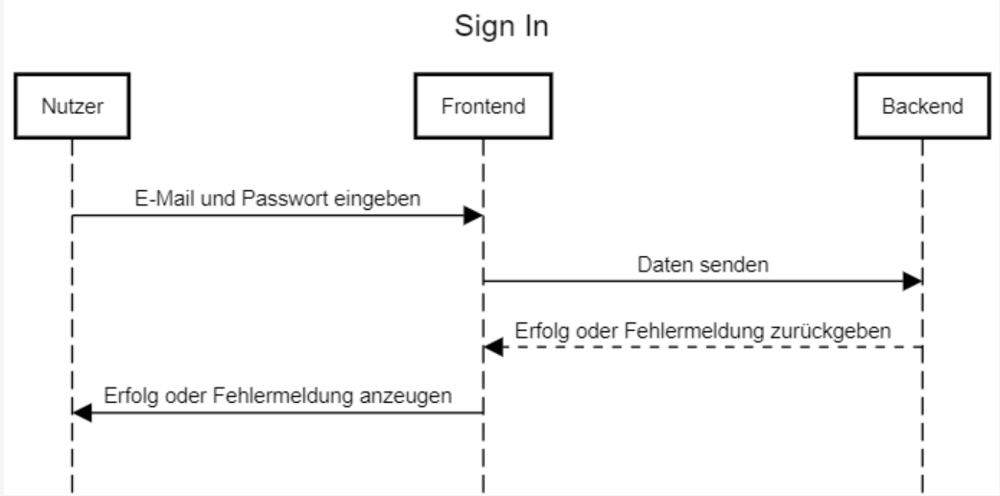
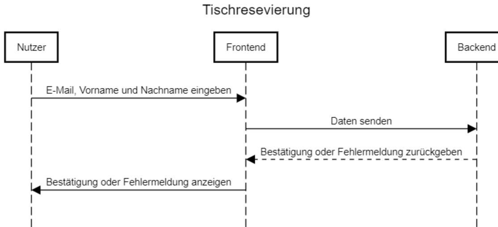

# Dritter Blogeintrag

Schön, dass ihr es wieder zu uns geschafft habt :)
Hier sind ein paar Updates zu unserem Projekt:

## Verhaltensmodellierungen

Wir haben die Verhaltensmodellierungen unseres Projektes erstellt, welche nachfolgend eingebunden sind.

Bein Registrierungsvorgang wird ein Nutzer aufgefordert, dessen E-Mail Adresse sowie ein sicheres Passwort einzugeben. 
Im nächsten Schritt wird die Eingabe überprüft und an das Backend weitergeleitet; dieses gibt daraufhin entweder eine Bestätigung, oder eine Fehlermeldung zurück, welche anschließend im Frontend angezeigt wird.

Bein Anmeldevorgang wird ein Nutzer aufgefordert, dessen Anmeldedaten bestehend aus E-Mail Adresse sowie Passwort einzugeben. 
Im nächsten Schritt wird die Eingabe überprüft und an das Backend weitergeleitet; dieses gibt daraufhin entweder eine Bestätigung, oder eine Fehlermeldung zurück, welche anschließend im Frontend angezeigt wird.

Bein Reservierungsvorgang wird ein Nutzer aufgefordert, dessen E-Mail Adresse sowie den Vor- und Nachnamen jener Person einzugeben, auf welche der Tisch reserviert wird.
Im nächsten Schritt wird die Eingabe überprüft und an das Backend weitergeleitet; dieses gibt daraufhin entweder eine Bestätigung, oder eine Fehlermeldung zurück, welche anschließend im Frontend angezeigt wird.

## Use-Case-Realization Specification (UCRS)

Des Weiteren haben wir ein [UCRS](../documentation/SRS/UCRS.md) erstellt, welche ihr gerne unter dem Hotlink einsehen könnt.

## Software Requirement Specification (SRS)

Unser im letzten Blog-Post vorgestelltes [SRS](../documentation/SoftwareRequirementDocumentation.md) könnt ihr euch ebenfalls gerne nochmals anschauen.

## sonstige Aufgaben
Ansonsten haben wir uns noch hiermit beschäftigt:
- Weiterführende Strukturierung unseres GitHub Repositorys
- Detailliertere Organisation des Projektes in unserem Jira

Schaut gerne beim nächsten Mal wieder vorbei, wir freuen uns auf euch ;)
Bei Wünschen oder Anregungen dürft ihr uns gerne schreiben, wir freuen uns auf euer Feedback!

Liebe Grüße 
Lukas, Alex, Moumen, Yahya und Alina
